# Level 1
## 1.0

You only use strings command and check correct input.

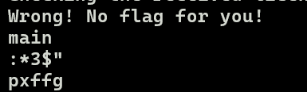

## 1.1
It is similar to level 1.0
# Level 2
## 2.0
It is similar to level before; however, it swaps indexes '2' and '3'.
## 2.1
It don't show require, so I need to download file challenge and use IDA to read code.
```cpp=
read(0, &buf, 5uLL);
v3 = BYTE1(buf);
BYTE1(buf) = BYTE2(buf);
BYTE2(buf) = v3;
puts("Checking the received license key!\n");
if ( !memcmp(&buf, aEyfry, 5uLL) )
{
    sub_12E9();
    exit(0);
}
```

You can see that, it swaps indexes '1' and '2'.
# Level 3

## 3.0
-Using IDA or you can read instruction after run this challenge.
-In IDA:
```cpp=
for ( j = 0; j <= 1; ++j )
{
    v3 = *((_BYTE *)&buf + j);
    *((_BYTE *)&buf + j) = *((_BYTE *)&buf + 4 - j);
    *((_BYTE *)&buf + 4 - j) = v3;
 }
```

```cpp=
if ( !memcmp(&buf, EXPECTED_RESULT, 5uLL) )
{
    win();
    exit(0);
}
```
`.data:0000000000004010 EXPECTED_RESULT db 'morjt',0            ; DATA XREF: main+2AF↑o`

-So, you need to inpur tjrom
## 3.1
-It similar to level 3.0.
# Level 4
Use IDA to read key.
# Level 5

## 5.0
-Use IDA to read expected result:

```cpp=
  for ( j = 0; j <= 4; ++j )
    *((_BYTE *)&buf + j) ^= 0x88u;
```
-It seem that xor every digit in your input with 0x88.
-You need to reverse xor.

```cpp=
hex = [0xF8, 0xE2, 0xEE, 0xE0, 0xEC]
for i in range(len(hex)):
    print(chr(hex[i] ^ 0x88), end='')
```

## 5.1
-Similar to 5.0

# Level 6

## 6.1

-I will start first at level 6.1 because it doesn't have command what challenge work in IDA

```cpp=
  for ( i = 0; i <= 7; ++i )
  {
    v3 = *((_BYTE *)buf + i);
    *((_BYTE *)buf + i) = *((_BYTE *)buf + 15 - i);
    *((_BYTE *)buf + 15 - i) = v3;
  }
  for ( j = 0; j <= 15; ++j )
    *((_BYTE *)buf + j) ^= 0x1Du;
  for ( k = 0; k <= 15; ++k )
  {
    if ( k % 2 )
    {
      if ( k % 2 == 1 )
        *((_BYTE *)buf + k) ^= 0xBAu;
    }
    else
    {
      *((_BYTE *)buf + k) ^= 0x5Eu;
    }
  }
```

-Look at this modification:
+In first loop from 0 to 7, it swap value at index i and index 15 - i.
+Xor all element with 0x1D
+Xor value at odd index with 0xBA and even index at 0x5E.


### [Script](https://github.com/BabyBroder/pwncollege/blob/Program-Security/Reverse-Engineering/src/level6_1.py)
# Level 7

## 7.1


xor at index mod 3

```cpp=
  for ( k = 0; k <= 24; ++k )
  {
    v3 = k % 3;
    if ( k % 3 == 2 )
    {
      *((_BYTE *)&buf + k) ^= 0x13u;
    }
    else if ( v3 <= 2 )
    {
      if ( v3 )
      {
        if ( v3 == 1 )
          *((_BYTE *)&buf + k) ^= 0xECu;
      }
      else
      {
        *((_BYTE *)&buf + k) ^= 0xA5u;
      }
    }
  }
```
sort

```cpp=
  for ( i = 0; i <= 23; ++i )
  {
    for ( j = 0; j < 24 - i; ++j )
    {
      if ( *((_BYTE *)&buf + j) > *((_BYTE *)&buf + j + 1) )
      {
        v7 = *((_BYTE *)&buf + j);
        *((_BYTE *)&buf + j) = *((_BYTE *)&buf + j + 1);
        *((_BYTE *)&buf + j + 1) = v7;
      }
    }
  }
```
### [Script](https://github.com/BabyBroder/pwncollege/blob/Program-Security/Reverse-Engineering/src/level7_1.py)

# Level 8

## 8.1


```cpp=
puts("Ready to receive your license key!\n");
  read(0, &buf, 0x26uLL);
  for ( i = 0; i <= 18; ++i )
  {
    v9 = *((_BYTE *)&buf + i);
    *((_BYTE *)&buf + i) = *((_BYTE *)&buf + 37 - i);
    *((_BYTE *)&buf + 37 - i) = v9;
  }
  for ( j = 0; j <= 18; ++j )
  {
    v8 = *((_BYTE *)&buf + j);
    *((_BYTE *)&buf + j) = *((_BYTE *)&buf + 37 - j);
    *((_BYTE *)&buf + 37 - j) = v8;
  }
  for ( k = 0; k <= 36; ++k )
  {
    for ( m = 0; m < 37 - k; ++m )
    {
      if ( *((_BYTE *)&buf + m) > *((_BYTE *)&buf + m + 1) )
      {
        v7 = *((_BYTE *)&buf + m);
        *((_BYTE *)&buf + m) = *((_BYTE *)&buf + m + 1);
        *((_BYTE *)&buf + m + 1) = v7;
      }
    }
  }
  v3 = BYTE5(v18);
  BYTE5(v18) = BYTE4(v19);
  BYTE4(v19) = v3;
  for ( n = 0; n <= 18; ++n )
  {
    v6 = *((_BYTE *)&buf + n);
    *((_BYTE *)&buf + n) = *((_BYTE *)&buf + 37 - n);
    *((_BYTE *)&buf + 37 - n) = v6;
  }
  for ( ii = 0; ii <= 18; ++ii )
  {
    v5 = *((_BYTE *)&buf + ii);
    *((_BYTE *)&buf + ii) = *((_BYTE *)&buf + 37 - ii);
    *((_BYTE *)&buf + 37 - ii) = v5;
  }
  for ( jj = 0; jj <= 18; ++jj )
  {
    v4 = *((_BYTE *)&buf + jj);
    *((_BYTE *)&buf + jj) = *((_BYTE *)&buf + 37 - jj);
    *((_BYTE *)&buf + 37 - jj) = v4;
  }
  puts("Checking the received license key!\n");
  if ( !memcmp(&buf, aZyxxuuuuutspon, 0x26uLL) )
  {
    sub_12E9();
    exit(0);
  }
  puts("Wrong! No flag for you!");
  exit(1);
}
```

-Read this code in IDA, you can see the step **Sort**.
-You only input your expected input and get the flag =)))

# Level 9

## 9.1

### Overall


```cpp=
void __fastcall __noreturn main(int a1, char **a2, char **a3)
{
  int v3; // eax
  unsigned __int8 v4; // [rsp+2Dh] [rbp-B3h] BYREF
  unsigned __int16 v5; // [rsp+2Eh] [rbp-B2h] BYREF
  int v6; // [rsp+30h] [rbp-B0h]
  int i; // [rsp+34h] [rbp-ACh]
  unsigned __int64 v8; // [rsp+38h] [rbp-A8h]
  char v9[96]; // [rsp+40h] [rbp-A0h] BYREF
  __int64 v10[2]; // [rsp+A0h] [rbp-40h] BYREF
  __int64 buf; // [rsp+B0h] [rbp-30h] BYREF
  __int64 v12; // [rsp+B8h] [rbp-28h]
  __int64 v13; // [rsp+C0h] [rbp-20h]
  __int16 v14; // [rsp+C8h] [rbp-18h]
  char v15; // [rsp+CAh] [rbp-16h]
  unsigned __int64 v16; // [rsp+D8h] [rbp-8h]

  v16 = __readfsqword(0x28u);
  if ( a1 <= 0 )
    __assert_fail("argc > 0", "<stdin>", 0x39u, "main");
  puts("###");
  printf("### Welcome to %s!\n", *a2);
  puts("###");
  putchar(10);
  setvbuf(stdin, 0LL, 2, 0LL);
  setvbuf(stdout, 0LL, 2, 1uLL);
  puts(
    "This license verifier software will allow you to read the flag. However, before you can do so, you must verify that you");
  puts("are licensed to read flag files! This program consumes a license key over stdin. Each program may perform entirely");
  puts(
    "different operations on that input! You must figure out (by reverse engineering this program) what that license key is.");
  puts("Providing the correct license key will net you the flag!\n");
  puts("Unfortunately for you, the license key cannot be reversed. You'll have to crack this program.\n");
  v6 = 0;
  v8 = ((unsigned __int64)sub_13A9 & 0xFFFFFFFFFFFFF000LL) - 4096;
  do
    v3 = v6++;
  while ( !mprotect((void *)((v3 << 12) + v8), 0x1000uLL, 7) );
  for ( i = 0; i <= 4; ++i )
  {
    printf("Changing byte %d/5.\n", (unsigned int)(i + 1));
    printf("Offset (hex) to change: ");
    __isoc99_scanf("%hx", &v5);
    printf("New value (hex): ");
    __isoc99_scanf("%hhx", &v4);
    *(_BYTE *)(v5 + v8) = v4;
    printf("The byte has been changed: *%p = %hhx.\n", (const void *)(v8 + v5), v4);
  }
  buf = 0LL;
  v12 = 0LL;
  v13 = 0LL;
  v14 = 0;
  v15 = 0;
  puts("Ready to receive your license key!\n");
  read(0, &buf, 0x1AuLL);
  MD5_Init(v9);
  MD5_Update(v9, &buf, 26LL);
  MD5_Final(v10, v9);
  memset(&buf, 0, 0x1AuLL);
  buf = v10[0];
  v12 = v10[1];
  puts("Checking the received license key!\n");
  if ( !memcmp(&buf, &unk_5010, 0x1AuLL) )
  {
    sub_1DAD();
    exit(0);
  }
  puts("Wrong! No flag for you!");
  exit(1);
}
```

***Input***
```cpp=
  read(0, &buf, 0x1AuLL);
  MD5_Init(v9);
  MD5_Update(v9, &buf, 26LL);
  MD5_Final(v10, v9);
  memset(&buf, 0, 0x1AuLL);
  buf = v10[0];
  v12 = v10[1];
```
- This challenge use MD5 to make private key.
- It is easy to see that I input buf, but buf will be set to 0 and change with the value of v10[0].
 
***Option change value***

```cpp=
*(_BYTE *)(v5 + v8) = v4;
```

### Approach


```antlr4=
   0x555555555ed6:      endbr64
   0x555555555eda:      push   rbp
   0x555555555edb:      mov    rbp,rsp
   0x555555555ede:      sub    rsp,0xe0
   0x555555555ee5:      mov    DWORD PTR [rbp-0xc4],edi
   0x555555555eeb:      mov    QWORD PTR [rbp-0xd0],rsi
   0x555555555ef2:      mov    QWORD PTR [rbp-0xd8],rdx
   0x555555555ef9:      mov    rax,QWORD PTR fs:0x28
   0x555555555f02:      mov    QWORD PTR [rbp-0x8],rax
   0x555555555f06:      xor    eax,eax
   0x555555555f08:      cmp    DWORD PTR [rbp-0xc4],0x0
   0x555555555f0f:      jg     0x555555555f30
   0x555555555f11:      lea    rcx,[rip+0x14fc]        # 0x555555557414
   0x555555555f18:      mov    edx,0x39
   0x555555555f1d:      lea    rsi,[rip+0x11e8]        # 0x55555555710c
   0x555555555f24:      lea    rdi,[rip+0x11e9]        # 0x555555557114
   0x555555555f2b:      call   0x5555555551d0 <__assert_fail@plt>
   0x555555555f30:      lea    rdi,[rip+0x11e6]        # 0x55555555711d
   0x555555555f37:      call   0x5555555551b0 <puts@plt>
   0x555555555f3c:      mov    rax,QWORD PTR [rbp-0xd0]
   0x555555555f43:      mov    rax,QWORD PTR [rax]
   0x555555555f46:      mov    rsi,rax
   0x555555555f49:      lea    rdi,[rip+0x11d1]        # 0x555555557121
   0x555555555f50:      mov    eax,0x0
   0x555555555f55:      call   0x555555555190 <printf@plt>
   0x555555555f5a:      lea    rdi,[rip+0x11bc]        # 0x55555555711d
   0x555555555f61:      call   0x5555555551b0 <puts@plt>
   0x555555555f66:      mov    edi,0xa
   0x555555555f6b:      call   0x5555555551f0 <putchar@plt>
   0x555555555f70:      mov    rax,QWORD PTR [rip+0x30b9]        # 0x555555559030 <stdin>
   0x555555555f77:      mov    ecx,0x0
   0x555555555f7c:      mov    edx,0x2
   0x555555555f81:      mov    esi,0x0
   0x555555555f86:      mov    rdi,rax
   0x555555555f89:      call   0x5555555551e0 <setvbuf@plt>
   0x555555555f8e:      mov    rax,QWORD PTR [rip+0x30a3]        # 0x555555559038 <stdout>
   0x555555555f95:      mov    ecx,0x1
   0x555555555f9a:      mov    edx,0x2
   0x555555555f9f:      mov    esi,0x0
   0x555555555fa4:      mov    rdi,rax
   0x555555555fa7:      call   0x5555555551e0 <setvbuf@plt>
   0x555555555fac:      lea    rdi,[rip+0x1185]        # 0x555555557138
   0x555555555fb3:      call   0x5555555551b0 <puts@plt>
   0x555555555fb8:      lea    rdi,[rip+0x11f1]        # 0x5555555571b0
   0x555555555fbf:      call   0x5555555551b0 <puts@plt>
   0x555555555fc4:      lea    rdi,[rip+0x125d]        # 0x555555557228
   0x555555555fcb:      call   0x5555555551b0 <puts@plt>
   0x555555555fd0:      lea    rdi,[rip+0x12c9]        # 0x5555555572a0
   0x555555555fd7:      call   0x5555555551b0 <puts@plt>
   0x555555555fdc:      lea    rdi,[rip+0x12fd]        # 0x5555555572e0
   0x555555555fe3:      call   0x5555555551b0 <puts@plt>
   0x555555555fe8:      mov    DWORD PTR [rbp-0xb0],0x0
   0x555555555ff2:      lea    rax,[rip+0xfffffffffffff3b0]        # 0x5555555553a9
   0x555555555ff9:      and    rax,0xfffffffffffff000
   0x555555555fff:      sub    rax,0x1000
   0x555555556005:      mov    QWORD PTR [rbp-0xa8],rax
   0x55555555600c:      nop
   0x55555555600d:      mov    eax,DWORD PTR [rbp-0xb0]
   0x555555556013:      lea    edx,[rax+0x1]
   0x555555556016:      mov    DWORD PTR [rbp-0xb0],edx
   0x55555555601c:      shl    eax,0xc
   0x55555555601f:      movsxd rdx,eax
   0x555555556022:      mov    rax,QWORD PTR [rbp-0xa8]
   0x555555556029:      add    rax,rdx
   0x55555555602c:      mov    edx,0x7
   0x555555556031:      mov    esi,0x1000
   0x555555556036:      mov    rdi,rax
   0x555555556039:      call   0x555555555180 <mprotect@plt>
   0x55555555603e:      test   eax,eax
   0x555555556040:      je     0x55555555600d
   0x555555556042:      mov    DWORD PTR [rbp-0xac],0x0
   0x55555555604c:      jmp    0x55555555611f
   0x555555556051:      mov    eax,DWORD PTR [rbp-0xac]
   0x555555556057:      add    eax,0x1
   0x55555555605a:      mov    esi,eax
   0x55555555605c:      lea    rdi,[rip+0x12dc]        # 0x55555555733f
   0x555555556063:      mov    eax,0x0
   0x555555556068:      call   0x555555555190 <printf@plt>
   0x55555555606d:      lea    rdi,[rip+0x12e0]        # 0x555555557354
   0x555555556074:      mov    eax,0x0
   0x555555556079:      call   0x555555555190 <printf@plt>
   0x55555555607e:      lea    rax,[rbp-0xb2]
   0x555555556085:      mov    rsi,rax
   0x555555556088:      lea    rdi,[rip+0x12de]        # 0x55555555736d
   0x55555555608f:      mov    eax,0x0
   0x555555556094:      call   0x555555555280 <__isoc99_scanf@plt>
   0x555555556099:      lea    rdi,[rip+0x12d1]        # 0x555555557371
   0x5555555560a0:      mov    eax,0x0
   0x5555555560a5:      call   0x555555555190 <printf@plt>
   0x5555555560aa:      lea    rax,[rbp-0xb3]
   0x5555555560b1:      mov    rsi,rax
   0x5555555560b4:      lea    rdi,[rip+0x12c8]        # 0x555555557383
   0x5555555560bb:      mov    eax,0x0
   0x5555555560c0:      call   0x555555555280 <__isoc99_scanf@plt>
   0x5555555560c5:      movzx  ecx,BYTE PTR [rbp-0xb3]
   0x5555555560cc:      movzx  eax,WORD PTR [rbp-0xb2]
   0x5555555560d3:      movzx  edx,ax
   0x5555555560d6:      mov    rax,QWORD PTR [rbp-0xa8]
   0x5555555560dd:      add    rax,rdx
   0x5555555560e0:      mov    edx,ecx
   0x5555555560e2:      mov    BYTE PTR [rax],dl
   0x5555555560e4:      movzx  eax,BYTE PTR [rbp-0xb3]
   0x5555555560eb:      movzx  eax,al
   0x5555555560ee:      movzx  edx,WORD PTR [rbp-0xb2]
   0x5555555560f5:      movzx  ecx,dx
   0x5555555560f8:      mov    rdx,QWORD PTR [rbp-0xa8]
   0x5555555560ff:      add    rcx,rdx
   0x555555556102:      mov    edx,eax
   0x555555556104:      mov    rsi,rcx
   0x555555556107:      lea    rdi,[rip+0x127a]        # 0x555555557388
   0x55555555610e:      mov    eax,0x0
   0x555555556113:      call   0x555555555190 <printf@plt>
   0x555555556118:      add    DWORD PTR [rbp-0xac],0x1
   0x55555555611f:      cmp    DWORD PTR [rbp-0xac],0x4
   0x555555556126:      jle    0x555555556051
   0x55555555612c:      mov    QWORD PTR [rbp-0x30],0x0
   0x555555556134:      mov    QWORD PTR [rbp-0x28],0x0
   0x55555555613c:      mov    QWORD PTR [rbp-0x20],0x0
   0x555555556144:      mov    WORD PTR [rbp-0x18],0x0
   0x55555555614a:      mov    BYTE PTR [rbp-0x16],0x0
   0x55555555614e:      lea    rdi,[rip+0x125b]        # 0x5555555573b0
   0x555555556155:      call   0x5555555551b0 <puts@plt>
   0x55555555615a:      lea    rax,[rbp-0x30]
   0x55555555615e:      mov    edx,0x1a
   0x555555556163:      mov    rsi,rax
   0x555555556166:      mov    edi,0x0
   0x55555555616b:      call   0x555555555200 <read@plt>
   0x555555556170:      lea    rax,[rbp-0xa0]
   0x555555556177:      mov    rdi,rax
   0x55555555617a:      call   0x555555555270 <MD5_Init@plt>
   0x55555555617f:      lea    rcx,[rbp-0x30]
   0x555555556183:      lea    rax,[rbp-0xa0]
   0x55555555618a:      mov    edx,0x1a
   0x55555555618f:      mov    rsi,rcx
   0x555555556192:      mov    rdi,rax
   0x555555556195:      call   0x555555555230 <MD5_Update@plt>
   0x55555555619a:      lea    rdx,[rbp-0xa0]
   0x5555555561a1:      lea    rax,[rbp-0x40]
   0x5555555561a5:      mov    rsi,rdx
   0x5555555561a8:      mov    rdi,rax
   0x5555555561ab:      call   0x555555555220 <MD5_Final@plt>
   0x5555555561b0:      lea    rax,[rbp-0x30]
   0x5555555561b4:      mov    edx,0x1a
   0x5555555561b9:      mov    esi,0x0
   0x5555555561be:      mov    rdi,rax
   0x5555555561c1:      call   0x5555555551a0 <memset@plt>
   0x5555555561c6:      mov    rax,QWORD PTR [rbp-0x40]
   0x5555555561ca:      mov    rdx,QWORD PTR [rbp-0x38]
   0x5555555561ce:      mov    QWORD PTR [rbp-0x30],rax
   0x5555555561d2:      mov    QWORD PTR [rbp-0x28],rdx
   0x5555555561d6:      lea    rdi,[rip+0x11fb]        # 0x5555555573d8
   0x5555555561dd:      call   0x5555555551b0 <puts@plt>
   0x5555555561e2:      lea    rax,[rbp-0x30]
   0x5555555561e6:      mov    edx,0x1a
   0x5555555561eb:      lea    rsi,[rip+0x2e1e]        # 0x555555559010
   0x5555555561f2:      mov    rdi,rax
   0x5555555561f5:      call   0x555555555290 <memcmp@plt>
   0x5555555561fa:      test   eax,eax
   0x5555555561fc:      jne    0x555555556212
   0x5555555561fe:      mov    eax,0x0
   0x555555556203:      call   0x555555555dad
   0x555555556208:      mov    edi,0x0
   0x55555555620d:      call   0x5555555551c0 <exit@plt>
   0x555555556212:      lea    rdi,[rip+0x11e3]        # 0x5555555573fc
   0x555555556219:      call   0x5555555551b0 <puts@plt>
   0x55555555621e:      mov    edi,0x1
   0x555555556223:      call   0x5555555551c0 <exit@plt>
```


The challenge allows me to change the value at the address starting from the address of v8.

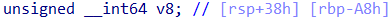

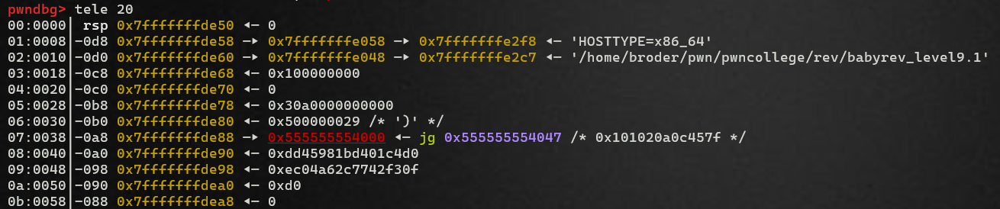


It gives me five times to change one byte -> I can change a maximum 10 bytes; however, memcmp compares with the length of 0x1A. Therefore, the idea of changing my buf to a key value is impossible.

***I see a special thing in IDA and when debugging.***

```cpp=
!mprotect((void *)((v3 << 12) + v8), 0x1000uLL, 7)
```

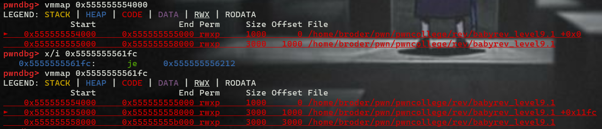

- So, I can change the assembly code =)))).
- I will change it to je instead of jne to trigger.

```antlr4=
jne: 75
je: 74
```

# Level 10
***This challenge is similar to level 9***

# Level 11

This challenge is to create two MD5 hashes and compare them together. Afterwards, it compares license key with ~~my input~~.

## 11.0


***Overwrite jne after memcmp two hashing values, and then input license key***


## 11.1
***It is different from level 11.0.***
***babyrev_level11.1***


```cpp=
void __fastcall __noreturn main(int a1, char **a2, char **a3)
{
  int v3; // eax
  unsigned __int8 v4; // [rsp+25h] [rbp-DBh] BYREF
  unsigned __int16 v5; // [rsp+26h] [rbp-DAh] BYREF
  int v6; // [rsp+28h] [rbp-D8h]
  int i; // [rsp+2Ch] [rbp-D4h]
  int j; // [rsp+30h] [rbp-D0h]
  int k; // [rsp+34h] [rbp-CCh]
  unsigned __int64 v10; // [rsp+38h] [rbp-C8h]
  char v11[96]; // [rsp+40h] [rbp-C0h] BYREF
  char s1[16]; // [rsp+A0h] [rbp-60h] BYREF
  char s2[16]; // [rsp+B0h] [rbp-50h] BYREF
  __int64 v14[2]; // [rsp+C0h] [rbp-40h] BYREF
  __int64 buf; // [rsp+D0h] [rbp-30h] BYREF
  __int64 v16; // [rsp+D8h] [rbp-28h]
  __int64 v17; // [rsp+E0h] [rbp-20h]
  int v18; // [rsp+E8h] [rbp-18h]
  __int16 v19; // [rsp+ECh] [rbp-14h]
  unsigned __int64 v20; // [rsp+F8h] [rbp-8h]

  v20 = __readfsqword(0x28u);
  if ( a1 <= 0 )
    __assert_fail("argc > 0", "<stdin>", 0x39u, "main");
  puts("###");
  printf("### Welcome to %s!\n", *a2);
  puts("###");
  putchar(10);
  setvbuf(stdin, 0LL, 2, 0LL);
  setvbuf(stdout, 0LL, 2, 1uLL);
  puts(
    "This license verifier software will allow you to read the flag. However, before you can do so, you must verify that you");
  puts("are licensed to read flag files! This program consumes a license key over stdin. Each program may perform entirely");
  puts(
    "different operations on that input! You must figure out (by reverse engineering this program) what that license key is.");
  puts("Providing the correct license key will net you the flag!\n");
  puts("Unfortunately for you, the license key cannot be reversed. You'll have to crack this program.\n");
  v6 = 0;
  v10 = ((unsigned __int64)sub_13A9 & 0xFFFFFFFFFFFFF000LL) - 4096;
  do
    v3 = v6++;
  while ( !mprotect((void *)((v3 << 12) + v10), 0x1000uLL, 7) );
  puts("In order to ensure code integrity, the code will be hashed and verified.\n");
  MD5_Init(v11);
  for ( i = 0; i < v6 - 1; ++i )
    MD5_Update(v11, (i << 12) + v10, 4096LL);
  MD5_Final(s1, v11);
  for ( j = 0; j <= 1; ++j )
  {
    printf("Changing byte %d/2.\n", (unsigned int)(j + 1));
    printf("Offset (hex) to change: ");
    __isoc99_scanf("%hx", &v5);
    printf("New value (hex): ");
    __isoc99_scanf("%hhx", &v4);
    *(_BYTE *)(v5 + v10) = v4;
    printf("The byte has been changed: *%p = %hhx.\n", (const void *)(v10 + v5), v4);
  }
  MD5_Init(v11);
  for ( k = 0; k < v6 - 1; ++k )
    MD5_Update(v11, (k << 12) + v10, 4096LL);
  MD5_Final(s2, v11);
  if ( !memcmp(s1, s2, 0x10uLL) )
  {
    puts("The code's integrity is secure!\n");
    buf = 0LL;
    v16 = 0LL;
    v17 = 0LL;
    v18 = 0;
    v19 = 0;
    puts("Ready to receive your license key!\n");
    read(0, &buf, 0x1DuLL);
    MD5_Init(v11);
    MD5_Update(v11, &buf, 29LL);
    MD5_Final(v14, v11);
    memset(&buf, 0, 0x1DuLL);
    buf = v14[0];
    v16 = v14[1];
    puts("Checking the received license key!\n");
    if ( !memcmp(&buf, &unk_4010, 0x1DuLL) )
    {
      sub_1923();
      exit(0);
    }
    puts("Wrong! No flag for you!");
    exit(1);
  }
  puts("The code's integrity has been breached, aborting!\n");
  exit(1);
}
```


If you use the same approach as the before level in the first change, you will get the segmentation fault.

***Solution***

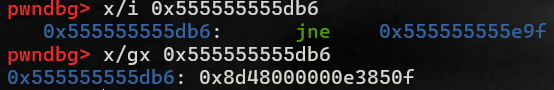
- As you can see, this is totally different from the challenge before.

[Online x86 / x64 Assembler and Disassembler](https://defuse.ca/online-x86-assembler.htm#disassembly)
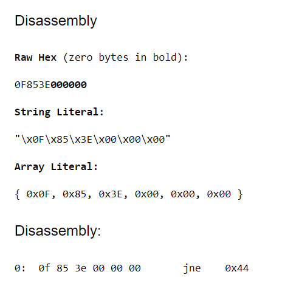
- When I disassemble, I see that assembly code.


Thus, I try with ```je 0x44```
- 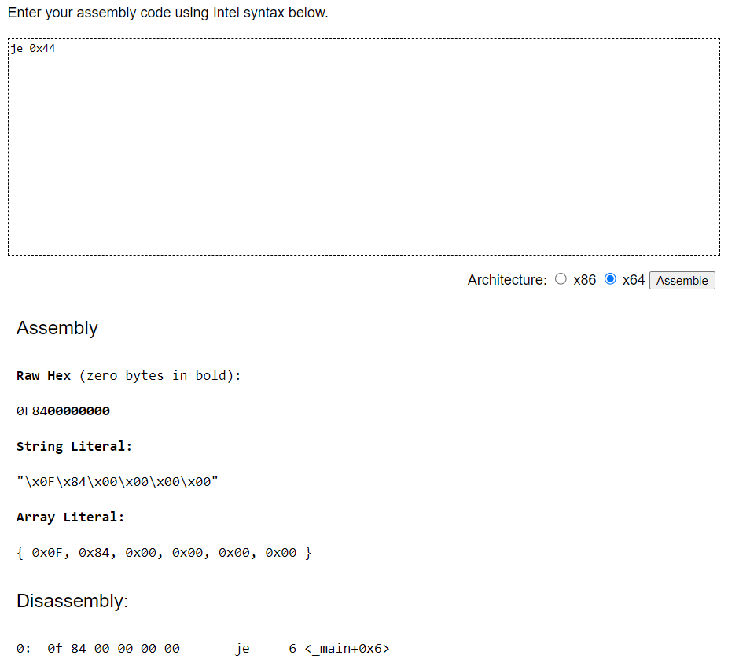


***Change the byte at 0x555555555db7 to 84.***


# Level 12
Baby rev with a different layout.

## 12.0

### [Script](https://github.com/BabyBroder/pwncollege/blob/Program-Security/Reverse-Engineering/src/level12.py)

## 12.1
### [Script](https://github.com/BabyBroder/pwncollege/blob/Program-Security/Reverse-Engineering/src/level12_1.py)

# Level 13


## 13.0

***execute_program***
```cpp=
void __fastcall __noreturn execute_program(__int64 a1)
{
  int v1; // eax
  int v2; // eax
  size_t v3; // rax
  _BOOL4 v4; // [rsp+1Ch] [rbp-94h]
  char buf[136]; // [rsp+20h] [rbp-90h] BYREF
  unsigned __int64 v6; // [rsp+A8h] [rbp-8h]

  v6 = __readfsqword(0x28u);
  read(0, (void *)(a1 + 52), 8uLL);
  interpret_imm(a1, 8LL, 84LL);
  interpret_imm(a1, 32LL, 1LL);
  interpret_imm(a1, 16LL, 16LL);
  interpret_stm(a1, 8LL, 16LL);
  interpret_add(a1, 8LL, 32LL);
  interpret_imm(a1, 16LL, 86LL);
  interpret_stm(a1, 8LL, 16LL);
  interpret_add(a1, 8LL, 32LL);
  interpret_imm(a1, 16LL, 249LL);
  interpret_stm(a1, 8LL, 16LL);
  interpret_add(a1, 8LL, 32LL);
  interpret_imm(a1, 16LL, 132LL);
  interpret_stm(a1, 8LL, 16LL);
  interpret_add(a1, 8LL, 32LL);
  interpret_imm(a1, 16LL, 94LL);
  interpret_stm(a1, 8LL, 16LL);
  interpret_add(a1, 8LL, 32LL);
  interpret_imm(a1, 16LL, 213LL);
  interpret_stm(a1, 8LL, 16LL);
  interpret_add(a1, 8LL, 32LL);
  interpret_imm(a1, 16LL, 216LL);
  interpret_stm(a1, 8LL, 16LL);
  interpret_add(a1, 8LL, 32LL);
  interpret_imm(a1, 16LL, 16LL);
  interpret_stm(a1, 8LL, 16LL);
  interpret_add(a1, 8LL, 32LL);
  v1 = memcmp((const void *)(a1 + 84), (const void *)(a1 + 52), 8uLL);
  v4 = v1 == 0;
  if ( v1 )
  {
    printf("INCORRECT!");
  }
  else
  {
    printf("CORRECT! Your flag: ");
    v2 = open("/flag", 0);
    v3 = read(v2, buf, 0x64uLL);
    write(1, buf, v3);
  }
  exit(!v4);
}
```

***describe_register***
```cpp=
__int16 *__fastcall describe_register(char a1)
{
  switch ( a1 )
  {
    case 16:
      return aAbcdsif;
    case 8:
      return &aAbcdsif[1];
    case 32:
      return &aAbcdsif[2];
    case 1:
      return &aAbcdsif[3];
    case 2:
      return &aAbcdsif[4];
    case 64:
      return &aAbcdsif[5];
    case 4:
      return &aAbcdsif[6];
  }
  if ( a1 )
    return (__int16 *)"?";
  return (__int16 *)"NONE";
}
```
- It takes the value of a1, after which return the address of array with the respective index.

***write_register***
```cpp=
_BYTE *__fastcall write_register(_BYTE *a1, char a2, char a3)
{
  _BYTE *result; // rax

  switch ( a2 )
  {
    case 16:
      result = a1;
      a1[256] = a3;
      break;
    case 8:
      result = a1;
      a1[257] = a3;
      break;
    case 32:
      result = a1;
      a1[258] = a3;
      break;
    case 1:
      result = a1;
      a1[259] = a3;
      break;
    case 2:
      result = a1;
      a1[260] = a3;
      break;
    case 64:
      result = a1;
      a1[261] = a3;
      break;
    case 4:
      result = a1;
      a1[262] = a3;
      break;
    default:
      crash(a1, "unknown register");
  }
  return result;
}
```
- It takes a2 as the index for table mapping and saves the value of a3 to the array a1 with the respective index. 

***read_register***
```cpp=
__int64 __fastcall read_register(unsigned __int8 *a1, char a2)
{
  switch ( a2 )
  {
    case 16:
      return a1[256];
    case 8:
      return a1[257];
    case 32:
      return a1[258];
    case 1:
      return a1[259];
    case 2:
      return a1[260];
    case 64:
      return a1[261];
  }
  if ( a2 != 4 )
    crash(a1, "unknown register");
  return a1[262];
}
```
- It takes the value of a2 for table mapping and return the value in array a1 with respective index.

***write_memory***
```cpp=
__int64 __fastcall write_memory(__int64 a1, unsigned __int8 a2, char a3)
{
  __int64 result; // rax

  result = a2;
  *(_BYTE *)(a1 + a2) = a3;
  return result;
}
```
- It saves the value of a3 at index a2 of a1.

***interpret_imm***
```cpp=
__int64 __fastcall interpret_imm(__int64 a1, unsigned __int8 a2, unsigned __int8 a3)
{
  unsigned int v3; // ebx
  const char *v4; // rax

  v3 = a3;
  v4 = (const char *)describe_register(a2);
  printf("[s] IMM %s = %#hhx\n", v4, v3);
  return write_register(a1, a2, a3);
}
```
- It depends on the value of a2(table mapping) to write the value of a3 to array a1 at the respective index(from 256 to 262)

***interpret_stm***
```cpp=
__int64 __fastcall interpret_stm(__int64 a1, unsigned __int8 a2, unsigned __int8 a3)
{
  __int16 *v3; // rbx
  __int16 *v4; // rax
  unsigned __int8 v5; // al

  v3 = describe_register(a3);
  v4 = describe_register(a2);
  printf("[s] STM *%s = %s\n", (const char *)v4, (const char *)v3);
  LODWORD(v3) = (unsigned __int8)read_register(a1, a3);
  v5 = read_register(a1, a2);
  return write_memory(a1, v5, (unsigned int)v3);
}
```
- First, it takes a3 to get the value at the respective index(256-262) of array a1 and save it to v3(result).
- Then, it takes a2 to get the value at the respective index(256-262) of array a1 and save it to v5(index).
- Finally, it does `a1[v5] = v3`

***interpret_add***
```cpp=
_BYTE *__fastcall interpret_add(unsigned __int8 *a1, char a2, char a3)
{
  __int16 *v3; // rbx
  __int16 *v4; // rax
  char v5; // al

  v3 = describe_register(a3);
  v4 = describe_register(a2);
  printf("[s] ADD %s %s\n", (const char *)v4, (const char *)v3);
  LOBYTE(v3) = read_register(a1, a2);
  v5 = read_register(a1, a3);
  return write_register(a1, a2, (unsigned __int8)v3 + v5);
}
```
- First, it takes a2 to get the value at the respective index(256-262) of array a1 and save it to v3.
- Next, it takes a3 to get the value at the respective index(256-262) of array a1 and save it to v5.
- Then, it relies on the value of a2 and save (v3 + v5) to the respective index(256-262) of array a1.

***Debug in gdb to get the informations and write them to script***

### [Script](https://github.com/BabyBroder/pwncollege/blob/Program-Security/Reverse-Engineering/src/level13.py)

## 13.1

- It is totally similar to 13.0, so I use trick to solve quickly this level.

### [Script](https://github.com/BabyBroder/pwncollege/blob/Program-Security/Reverse-Engineering/src/level13_1.py)

# Level 14

## 14.0

In this level, it gives me one more function.

***interpret_sys***
```cpp=
int __fastcall interpret_sys(unsigned __int8 *a1, unsigned __int8 a2, unsigned __int8 a3)
{
  const char *v3; // rax
  unsigned __int8 v4; // al
  unsigned __int64 v5; // rax
  unsigned __int8 v6; // al
  unsigned __int64 v7; // rax
  unsigned __int8 v8; // al
  unsigned __int8 v9; // al
  int result; // eax
  unsigned int v11; // ebx
  const char *v12; // rax

  v3 = (const char *)describe_register(a3);
  printf("[s] SYS %#hhx %s\n", a2, v3);
  if ( (a2 & 0x20) != 0 )
  {
    puts("[s] ... open");
    v4 = sys_open(a1, &a1[a1[256]], a1[257], a1[258]);
    write_register(a1, a3, v4);
  }
  if ( (a2 & 1) != 0 )
  {
    puts("[s] ... read_memory");
    v5 = a1[258];
    if ( 256 - a1[257] <= v5 )
      LOBYTE(v5) = -a1[257];
    v6 = sys_read(a1, a1[256], &a1[a1[257]], (unsigned __int8)v5);
    write_register(a1, a3, v6);
  }
  if ( (a2 & 8) != 0 )
  {
    puts("[s] ... write");
    v7 = a1[258];
    if ( 256 - a1[257] <= v7 )
      LOBYTE(v7) = -a1[257];
    v8 = sys_write(a1, a1[256], &a1[a1[257]], (unsigned __int8)v7);
    write_register(a1, a3, v8);
  }
  if ( (a2 & 4) != 0 )
  {
    puts("[s] ... sleep");
    v9 = sys_sleep(a1, a1[256]);
    write_register(a1, a3, v9);
  }
  result = a2 & 0x10;
  if ( (a2 & 0x10) != 0 )
  {
    puts("[s] ... exit");
    sys_exit(a1, a1[256]);
  }
  if ( a3 )
  {
    v11 = (unsigned __int8)read_register(a1, a3);
    v12 = (const char *)describe_register(a3);
    return printf("[s] ... return value (in register %s): %#hhx\n", v12, v11);
  }
  return result;
}
```


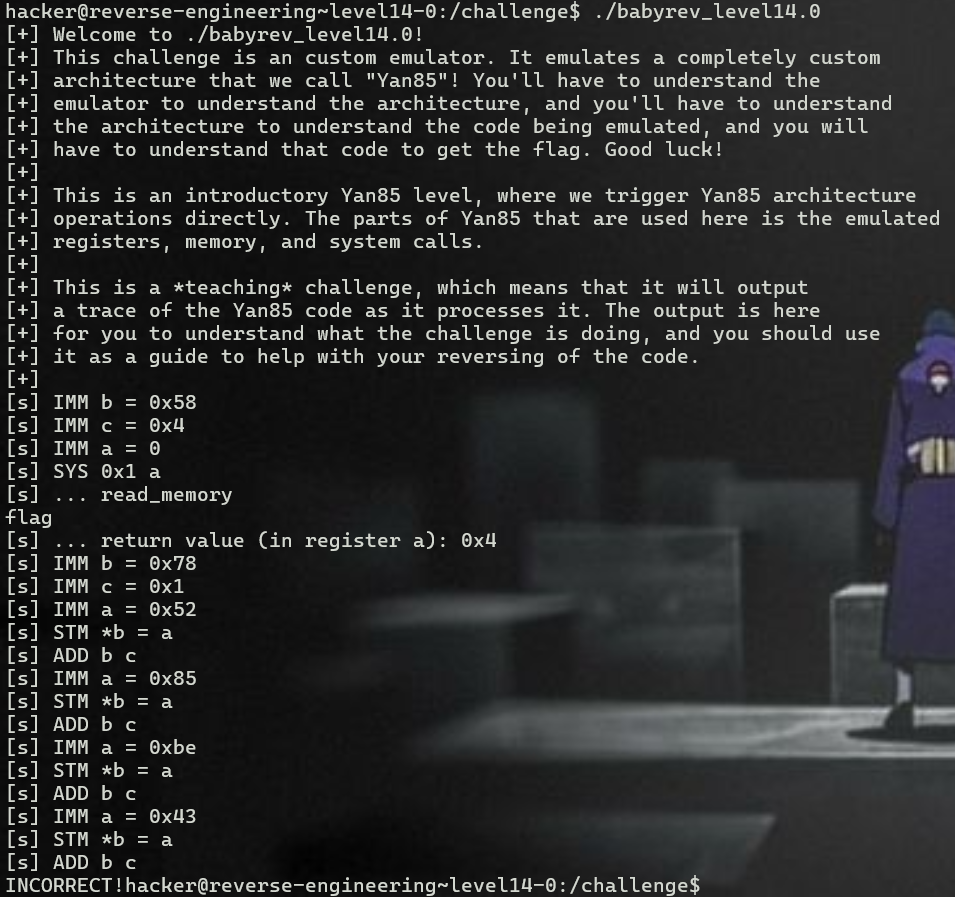
- As you see, in function interpret_sys, it only call `[s] ... read_memory`, so I only notice it.

```cpp=
  if ( (a2 & 1) != 0 )
  {
    puts("[s] ... read_memory");
    v5 = a1[258];
    if ( 256 - a1[257] <= v5 )
      LOBYTE(v5) = -a1[257];
    v6 = sys_read(a1, a1[256], &a1[a1[257]], (unsigned __int8)v5);
    write_register(a1, a3, v6);
  }
```

```cpp=
ssize_t __fastcall sys_read(__int64 a1, int a2, void *a3, size_t a4)
{
  return read(a2, a3, a4);
}
```

***In this level, this function will take my input, whose length is v5(a1[258]) and save it into the array a1, from index 257.***

### [Script](https://github.com/BabyBroder/pwncollege/blob/Program-Security/Reverse-Engineering/src/level14.py)
## 14.1

### [Script](https://github.com/BabyBroder/pwncollege/blob/Program-Security/Reverse-Engineering/src/level14_1.py)

# Level 15

## 15.0
***execute_program***
```cpp=
__int64 __fastcall execute_program(__int64 a1)
{
  _BOOL4 v2; // [rsp+1Ch] [rbp-4h]

  interpret_imm(a1, 1LL, 79LL);
  interpret_imm(a1, 8LL, 8LL);
  interpret_imm(a1, 64LL, 0LL);
  interpret_sys(a1, 2LL, 64LL);
  interpret_imm(a1, 1LL, 111LL);
  interpret_imm(a1, 8LL, 1LL);
  interpret_imm(a1, 64LL, 99LL);
  interpret_stm(a1, 1LL, 64LL);
  interpret_add(a1, 1LL, 8LL);
  interpret_imm(a1, 64LL, 15LL);
  interpret_stm(a1, 1LL, 64LL);
  interpret_add(a1, 1LL, 8LL);
  interpret_imm(a1, 64LL, 90LL);
  interpret_stm(a1, 1LL, 64LL);
  interpret_add(a1, 1LL, 8LL);
  interpret_imm(a1, 64LL, 125LL);
  interpret_stm(a1, 1LL, 64LL);
  interpret_add(a1, 1LL, 8LL);
  interpret_imm(a1, 64LL, 120LL);
  interpret_stm(a1, 1LL, 64LL);
  interpret_add(a1, 1LL, 8LL);
  interpret_imm(a1, 64LL, 1LL);
  interpret_stm(a1, 1LL, 64LL);
  interpret_add(a1, 1LL, 8LL);
  interpret_imm(a1, 64LL, 143LL);
  interpret_stm(a1, 1LL, 64LL);
  interpret_add(a1, 1LL, 8LL);
  interpret_imm(a1, 64LL, 87LL);
  interpret_stm(a1, 1LL, 64LL);
  interpret_add(a1, 1LL, 8LL);
  v2 = memcmp((const void *)(a1 + 111), (const void *)(a1 + 79), 8uLL) == 0;
  interpret_imm(a1, 64LL, 1LL);
  interpret_imm(a1, 1LL, 0LL);
  interpret_imm(a1, 8LL, 1LL);
  if ( v2 )
  {
    interpret_imm(a1, 2LL, 67LL);
    interpret_stm(a1, 1LL, 2LL);
    interpret_sys(a1, 8LL, 64LL);
    interpret_imm(a1, 2LL, 79LL);
    interpret_stm(a1, 1LL, 2LL);
    interpret_sys(a1, 8LL, 64LL);
    interpret_imm(a1, 2LL, 82LL);
    interpret_stm(a1, 1LL, 2LL);
    interpret_sys(a1, 8LL, 64LL);
    interpret_imm(a1, 2LL, 82LL);
    interpret_stm(a1, 1LL, 2LL);
    interpret_sys(a1, 8LL, 64LL);
    interpret_imm(a1, 2LL, 69LL);
    interpret_stm(a1, 1LL, 2LL);
    interpret_sys(a1, 8LL, 64LL);
    interpret_imm(a1, 2LL, 67LL);
    interpret_stm(a1, 1LL, 2LL);
    interpret_sys(a1, 8LL, 64LL);
    interpret_imm(a1, 2LL, 84LL);
    interpret_stm(a1, 1LL, 2LL);
    interpret_sys(a1, 8LL, 64LL);
    interpret_imm(a1, 2LL, 33LL);
    interpret_stm(a1, 1LL, 2LL);
    interpret_sys(a1, 8LL, 64LL);
    interpret_imm(a1, 2LL, 32LL);
    interpret_stm(a1, 1LL, 2LL);
    interpret_sys(a1, 8LL, 64LL);
    interpret_imm(a1, 2LL, 89LL);
    interpret_stm(a1, 1LL, 2LL);
    interpret_sys(a1, 8LL, 64LL);
    interpret_imm(a1, 2LL, 111LL);
    interpret_stm(a1, 1LL, 2LL);
    interpret_sys(a1, 8LL, 64LL);
    interpret_imm(a1, 2LL, 117LL);
    interpret_stm(a1, 1LL, 2LL);
    interpret_sys(a1, 8LL, 64LL);
    interpret_imm(a1, 2LL, 114LL);
    interpret_stm(a1, 1LL, 2LL);
    interpret_sys(a1, 8LL, 64LL);
    interpret_imm(a1, 2LL, 32LL);
    interpret_stm(a1, 1LL, 2LL);
    interpret_sys(a1, 8LL, 64LL);
    interpret_imm(a1, 2LL, 102LL);
    interpret_stm(a1, 1LL, 2LL);
    interpret_sys(a1, 8LL, 64LL);
    interpret_imm(a1, 2LL, 108LL);
    interpret_stm(a1, 1LL, 2LL);
    interpret_sys(a1, 8LL, 64LL);
    interpret_imm(a1, 2LL, 97LL);
    interpret_stm(a1, 1LL, 2LL);
    interpret_sys(a1, 8LL, 64LL);
    interpret_imm(a1, 2LL, 103LL);
    interpret_stm(a1, 1LL, 2LL);
    interpret_sys(a1, 8LL, 64LL);
    interpret_imm(a1, 2LL, 58LL);
    interpret_stm(a1, 1LL, 2LL);
    interpret_sys(a1, 8LL, 64LL);
    interpret_imm(a1, 2LL, 10LL);
    interpret_stm(a1, 1LL, 2LL);
    interpret_sys(a1, 8LL, 64LL);
    interpret_imm(a1, 2LL, 47LL);
    interpret_imm(a1, 1LL, 0LL);
    interpret_stm(a1, 1LL, 2LL);
    interpret_imm(a1, 2LL, 102LL);
    interpret_imm(a1, 1LL, 1LL);
    interpret_stm(a1, 1LL, 2LL);
    interpret_imm(a1, 2LL, 108LL);
    interpret_imm(a1, 1LL, 2LL);
    interpret_stm(a1, 1LL, 2LL);
    interpret_imm(a1, 2LL, 97LL);
    interpret_imm(a1, 1LL, 3LL);
    interpret_stm(a1, 1LL, 2LL);
    interpret_imm(a1, 2LL, 103LL);
    interpret_imm(a1, 1LL, 4LL);
    interpret_stm(a1, 1LL, 2LL);
    interpret_imm(a1, 2LL, 0LL);
    interpret_imm(a1, 1LL, 5LL);
    interpret_stm(a1, 1LL, 2LL);
    interpret_imm(a1, 64LL, 0LL);
    interpret_imm(a1, 1LL, 0LL);
    interpret_sys(a1, 32LL, 64LL);
    interpret_imm(a1, 8LL, 100LL);
    interpret_sys(a1, 2LL, 8LL);
    interpret_imm(a1, 64LL, 1LL);
    interpret_sys(a1, 8LL, 8LL);
    interpret_imm(a1, 64LL, 0LL);
  }
  else
  {
    interpret_imm(a1, 2LL, 73LL);
    interpret_stm(a1, 1LL, 2LL);
    interpret_sys(a1, 8LL, 64LL);
    interpret_imm(a1, 2LL, 78LL);
    interpret_stm(a1, 1LL, 2LL);
    interpret_sys(a1, 8LL, 64LL);
    interpret_imm(a1, 2LL, 67LL);
    interpret_stm(a1, 1LL, 2LL);
    interpret_sys(a1, 8LL, 64LL);
    interpret_imm(a1, 2LL, 79LL);
    interpret_stm(a1, 1LL, 2LL);
    interpret_sys(a1, 8LL, 64LL);
    interpret_imm(a1, 2LL, 82LL);
    interpret_stm(a1, 1LL, 2LL);
    interpret_sys(a1, 8LL, 64LL);
    interpret_imm(a1, 2LL, 82LL);
    interpret_stm(a1, 1LL, 2LL);
    interpret_sys(a1, 8LL, 64LL);
    interpret_imm(a1, 2LL, 69LL);
    interpret_stm(a1, 1LL, 2LL);
    interpret_sys(a1, 8LL, 64LL);
    interpret_imm(a1, 2LL, 67LL);
    interpret_stm(a1, 1LL, 2LL);
    interpret_sys(a1, 8LL, 64LL);
    interpret_imm(a1, 2LL, 84LL);
    interpret_stm(a1, 1LL, 2LL);
    interpret_sys(a1, 8LL, 64LL);
    interpret_imm(a1, 2LL, 33LL);
    interpret_stm(a1, 1LL, 2LL);
    interpret_sys(a1, 8LL, 64LL);
    interpret_imm(a1, 64LL, 1LL);
  }
  interpret_imm(a1, 2LL, 10LL);
  interpret_stm(a1, 1LL, 2LL);
  interpret_sys(a1, 8LL, 64LL);
  return interpret_sys(a1, 16LL, 64LL);
}
```

- In this level, I must to make `v2 != 0` to get the flag.

The difference between this level and the previous level is that function interpret_sys has options `[s] ... write` and `[s] ... exit`
- 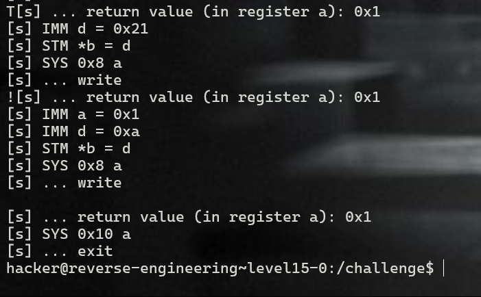


```cpp=
  if ( (a2 & 0x10) != 0 )
  {
    puts("[s] ... exit");
    exit(a1[256]);
  }
```
- It is simply that the program exits
```cpp=
  if ( (a2 & 8) != 0 )
  {
    puts("[s] ... write");
    v7 = a1[258];
    if ( 256 - a1[257] <= v7 )
      LOBYTE(v7) = -a1[257];
    v8 = write(a1[256], &a1[a1[257]], (unsigned __int8)v7);
    write_register(a1, a3, v8);
  }
```
- It writes the value at index a1[257] of array a1 with length 1 to stdout 


### [Script](https://github.com/BabyBroder/pwncollege/blob/Program-Security/Reverse-Engineering/src/level15.py)

## 15.1
### [Script](https://github.com/BabyBroder/pwncollege/blob/Program-Security/Reverse-Engineering/src/level15_1.py)

# Level 16

## 16.0

In this level, we have two more functions.

***interpret_ldm***
```cpp=
_BYTE *__fastcall interpret_ldm(unsigned __int8 *a1, char a2, char a3)
{
  __int16 *v3; // rbx
  __int16 *v4; // rax
  unsigned __int8 v5; // al
  char memory; // al

  v3 = describe_register(a3);
  v4 = describe_register(a2);
  printf("[s] LDM %s = *%s\n", (const char *)v4, (const char *)v3);
  v5 = read_register(a1, a3);
  memory = read_memory((__int64)a1, v5);
  return write_register(a1, a2, memory);
}
```

***interpret_cmp***
```cpp=
unsigned __int64 __fastcall interpret_cmp(unsigned __int8 *a1, char a2, char a3)
{
  __int16 *v3; // rbx
  __int16 *v4; // rax
  unsigned __int64 result; // rax
  unsigned __int8 v7; // [rsp+1Eh] [rbp-12h]
  unsigned __int8 v8; // [rsp+1Fh] [rbp-11h]

  v3 = describe_register(a3);
  v4 = describe_register(a2);
  printf("[s] CMP %s %s\n", (const char *)v4, (const char *)v3);
  v7 = read_register(a1, a2);
  v8 = read_register(a1, a3);
  a1[262] = 0;
  if ( v7 < v8 )
    a1[262] |= 2u;
  if ( v7 > v8 )
    a1[262] |= 4u;
  if ( v7 == v8 )
    a1[262] |= 0x10u;
  result = v7;
  if ( v7 != v8 )
  {
    result = (unsigned __int64)a1;
    a1[262] |= 1u;
  }
  if ( !v7 && !v8 )
  {
    result = (unsigned __int64)a1;
    a1[262] |= 8u;
  }
  return result;
}
```

***execute_program***
```cpp=
int __fastcall execute_program(unsigned __int8 *a1)
{
  _BOOL4 v2; // [rsp+1Ch] [rbp-4h]

  interpret_imm((__int64)a1, 0x10u, 0x73u);
  interpret_imm((__int64)a1, 1u, 8u);
  interpret_imm((__int64)a1, 0x20u, 0);
  interpret_sys(a1, 0x20u, 0x20u);
  interpret_imm((__int64)a1, 0x10u, 0x93u);
  interpret_imm((__int64)a1, 1u, 1u);
  interpret_imm((__int64)a1, 0x20u, 0xB2u);
  interpret_stm(a1, 16LL, 32LL);
  interpret_add(a1, 0x10u, 1u);
  interpret_imm((__int64)a1, 0x20u, 0x8Au);
  interpret_stm(a1, 16LL, 32LL);
  interpret_add(a1, 0x10u, 1u);
  interpret_imm((__int64)a1, 0x20u, 0x6Eu);
  interpret_stm(a1, 16LL, 32LL);
  interpret_add(a1, 0x10u, 1u);
  interpret_imm((__int64)a1, 0x20u, 0x5Au);
  interpret_stm(a1, 16LL, 32LL);
  interpret_add(a1, 0x10u, 1u);
  interpret_imm((__int64)a1, 0x20u, 0xAFu);
  interpret_stm(a1, 16LL, 32LL);
  interpret_add(a1, 0x10u, 1u);
  interpret_imm((__int64)a1, 0x20u, 0x33u);
  interpret_stm(a1, 16LL, 32LL);
  interpret_add(a1, 0x10u, 1u);
  interpret_imm((__int64)a1, 0x20u, 0xE9u);
  interpret_stm(a1, 16LL, 32LL);
  interpret_add(a1, 0x10u, 1u);
  interpret_imm((__int64)a1, 0x20u, 0xB9u);
  interpret_stm(a1, 16LL, 32LL);
  interpret_add(a1, 0x10u, 1u);
  interpret_imm((__int64)a1, 0x10u, 0x93u);
  interpret_ldm(a1, 16, 16);
  interpret_imm((__int64)a1, 0x20u, 0x73u);
  interpret_ldm(a1, 32, 32);
  interpret_cmp(a1, 32, 16);
  v2 = (a1[262] & 0x10) != 0;
  interpret_imm((__int64)a1, 0x10u, 0x94u);
  interpret_ldm(a1, 16, 16);
  interpret_imm((__int64)a1, 0x20u, 0x74u);
  interpret_ldm(a1, 32, 32);
  interpret_cmp(a1, 32, 16);
  if ( (a1[262] & 0x10) == 0 )
    v2 = 0;
  interpret_imm((__int64)a1, 0x10u, 0x95u);
  interpret_ldm(a1, 16, 16);
  interpret_imm((__int64)a1, 0x20u, 0x75u);
  interpret_ldm(a1, 32, 32);
  interpret_cmp(a1, 32, 16);
  if ( (a1[262] & 0x10) == 0 )
    v2 = 0;
  interpret_imm((__int64)a1, 0x10u, 0x96u);
  interpret_ldm(a1, 16, 16);
  interpret_imm((__int64)a1, 0x20u, 0x76u);
  interpret_ldm(a1, 32, 32);
  interpret_cmp(a1, 32, 16);
  if ( (a1[262] & 0x10) == 0 )
    v2 = 0;
  interpret_imm((__int64)a1, 0x10u, 0x97u);
  interpret_ldm(a1, 16, 16);
  interpret_imm((__int64)a1, 0x20u, 0x77u);
  interpret_ldm(a1, 32, 32);
  interpret_cmp(a1, 32, 16);
  if ( (a1[262] & 0x10) == 0 )
    v2 = 0;
  interpret_imm((__int64)a1, 0x10u, 0x98u);
  interpret_ldm(a1, 16, 16);
  interpret_imm((__int64)a1, 0x20u, 0x78u);
  interpret_ldm(a1, 32, 32);
  interpret_cmp(a1, 32, 16);
  if ( (a1[262] & 0x10) == 0 )
    v2 = 0;
  interpret_imm((__int64)a1, 0x10u, 0x99u);
  interpret_ldm(a1, 16, 16);
  interpret_imm((__int64)a1, 0x20u, 0x79u);
  interpret_ldm(a1, 32, 32);
  interpret_cmp(a1, 32, 16);
  if ( (a1[262] & 0x10) == 0 )
    v2 = 0;
  interpret_imm((__int64)a1, 0x10u, 0x9Au);
  interpret_ldm(a1, 16, 16);
  interpret_imm((__int64)a1, 0x20u, 0x7Au);
  interpret_ldm(a1, 32, 32);
  interpret_cmp(a1, 32, 16);
  if ( (a1[262] & 0x10) == 0 )
    v2 = 0;
  interpret_imm((__int64)a1, 0x20u, 1u);
  interpret_imm((__int64)a1, 0x10u, 0);
  interpret_imm((__int64)a1, 1u, 1u);
  if ( v2 )
  {
    interpret_imm((__int64)a1, 8u, 0x43u);
    interpret_stm(a1, 16LL, 8LL);
    interpret_sys(a1, 2u, 0x20u);
    interpret_imm((__int64)a1, 8u, 0x4Fu);
    interpret_stm(a1, 16LL, 8LL);
    interpret_sys(a1, 2u, 0x20u);
    interpret_imm((__int64)a1, 8u, 0x52u);
    interpret_stm(a1, 16LL, 8LL);
    interpret_sys(a1, 2u, 0x20u);
    interpret_imm((__int64)a1, 8u, 0x52u);
    interpret_stm(a1, 16LL, 8LL);
    interpret_sys(a1, 2u, 0x20u);
    interpret_imm((__int64)a1, 8u, 0x45u);
    interpret_stm(a1, 16LL, 8LL);
    interpret_sys(a1, 2u, 0x20u);
    interpret_imm((__int64)a1, 8u, 0x43u);
    interpret_stm(a1, 16LL, 8LL);
    interpret_sys(a1, 2u, 0x20u);
    interpret_imm((__int64)a1, 8u, 0x54u);
    interpret_stm(a1, 16LL, 8LL);
    interpret_sys(a1, 2u, 0x20u);
    interpret_imm((__int64)a1, 8u, 0x21u);
    interpret_stm(a1, 16LL, 8LL);
    interpret_sys(a1, 2u, 0x20u);
    interpret_imm((__int64)a1, 8u, 0x20u);
    interpret_stm(a1, 16LL, 8LL);
    interpret_sys(a1, 2u, 0x20u);
    interpret_imm((__int64)a1, 8u, 0x59u);
    interpret_stm(a1, 16LL, 8LL);
    interpret_sys(a1, 2u, 0x20u);
    interpret_imm((__int64)a1, 8u, 0x6Fu);
    interpret_stm(a1, 16LL, 8LL);
    interpret_sys(a1, 2u, 0x20u);
    interpret_imm((__int64)a1, 8u, 0x75u);
    interpret_stm(a1, 16LL, 8LL);
    interpret_sys(a1, 2u, 0x20u);
    interpret_imm((__int64)a1, 8u, 0x72u);
    interpret_stm(a1, 16LL, 8LL);
    interpret_sys(a1, 2u, 0x20u);
    interpret_imm((__int64)a1, 8u, 0x20u);
    interpret_stm(a1, 16LL, 8LL);
    interpret_sys(a1, 2u, 0x20u);
    interpret_imm((__int64)a1, 8u, 0x66u);
    interpret_stm(a1, 16LL, 8LL);
    interpret_sys(a1, 2u, 0x20u);
    interpret_imm((__int64)a1, 8u, 0x6Cu);
    interpret_stm(a1, 16LL, 8LL);
    interpret_sys(a1, 2u, 0x20u);
    interpret_imm((__int64)a1, 8u, 0x61u);
    interpret_stm(a1, 16LL, 8LL);
    interpret_sys(a1, 2u, 0x20u);
    interpret_imm((__int64)a1, 8u, 0x67u);
    interpret_stm(a1, 16LL, 8LL);
    interpret_sys(a1, 2u, 0x20u);
    interpret_imm((__int64)a1, 8u, 0x3Au);
    interpret_stm(a1, 16LL, 8LL);
    interpret_sys(a1, 2u, 0x20u);
    interpret_imm((__int64)a1, 8u, 0xAu);
    interpret_stm(a1, 16LL, 8LL);
    interpret_sys(a1, 2u, 0x20u);
    interpret_imm((__int64)a1, 8u, 0x2Fu);
    interpret_imm((__int64)a1, 0x10u, 0);
    interpret_stm(a1, 16LL, 8LL);
    interpret_imm((__int64)a1, 8u, 0x66u);
    interpret_imm((__int64)a1, 0x10u, 1u);
    interpret_stm(a1, 16LL, 8LL);
    interpret_imm((__int64)a1, 8u, 0x6Cu);
    interpret_imm((__int64)a1, 0x10u, 2u);
    interpret_stm(a1, 16LL, 8LL);
    interpret_imm((__int64)a1, 8u, 0x61u);
    interpret_imm((__int64)a1, 0x10u, 3u);
    interpret_stm(a1, 16LL, 8LL);
    interpret_imm((__int64)a1, 8u, 0x67u);
    interpret_imm((__int64)a1, 0x10u, 4u);
    interpret_stm(a1, 16LL, 8LL);
    interpret_imm((__int64)a1, 8u, 0);
    interpret_imm((__int64)a1, 0x10u, 5u);
    interpret_stm(a1, 16LL, 8LL);
    interpret_imm((__int64)a1, 0x20u, 0);
    interpret_imm((__int64)a1, 0x10u, 0);
    interpret_sys(a1, 8u, 0x20u);
    interpret_imm((__int64)a1, 1u, 0x64u);
    interpret_sys(a1, 0x20u, 1u);
    interpret_imm((__int64)a1, 0x20u, 1u);
    interpret_sys(a1, 2u, 1u);
    interpret_imm((__int64)a1, 0x20u, 0);
  }
  else
  {
    interpret_imm((__int64)a1, 8u, 0x49u);
    interpret_stm(a1, 16LL, 8LL);
    interpret_sys(a1, 2u, 0x20u);
    interpret_imm((__int64)a1, 8u, 0x4Eu);
    interpret_stm(a1, 16LL, 8LL);
    interpret_sys(a1, 2u, 0x20u);
    interpret_imm((__int64)a1, 8u, 0x43u);
    interpret_stm(a1, 16LL, 8LL);
    interpret_sys(a1, 2u, 0x20u);
    interpret_imm((__int64)a1, 8u, 0x4Fu);
    interpret_stm(a1, 16LL, 8LL);
    interpret_sys(a1, 2u, 0x20u);
    interpret_imm((__int64)a1, 8u, 0x52u);
    interpret_stm(a1, 16LL, 8LL);
    interpret_sys(a1, 2u, 0x20u);
    interpret_imm((__int64)a1, 8u, 0x52u);
    interpret_stm(a1, 16LL, 8LL);
    interpret_sys(a1, 2u, 0x20u);
    interpret_imm((__int64)a1, 8u, 0x45u);
    interpret_stm(a1, 16LL, 8LL);
    interpret_sys(a1, 2u, 0x20u);
    interpret_imm((__int64)a1, 8u, 0x43u);
    interpret_stm(a1, 16LL, 8LL);
    interpret_sys(a1, 2u, 0x20u);
    interpret_imm((__int64)a1, 8u, 0x54u);
    interpret_stm(a1, 16LL, 8LL);
    interpret_sys(a1, 2u, 0x20u);
    interpret_imm((__int64)a1, 8u, 0x21u);
    interpret_stm(a1, 16LL, 8LL);
    interpret_sys(a1, 2u, 0x20u);
    interpret_imm((__int64)a1, 0x20u, 1u);
  }
  interpret_imm((__int64)a1, 8u, 0xAu);
  interpret_stm(a1, 16LL, 8LL);
  interpret_sys(a1, 2u, 0x20u);
  return interpret_sys(a1, 1u, 0x20u);
}
```

I notice the special execute_program

- From line 5 to line 34: create a license key
- From line 35 to 92: in every next stage: 
    - interpret_imm → interpret_ldm → interpret_imm → interpret_ldm → interpret_cmp
    - Every interpret function are the same, except for interpret_ldm.
        - `interpret_ldm(a1, 16, 16);`
        - `interpret_ldm(a1, 32, 32);`

I will get the first stage to explain
```python=
#save the value at the third agrument to a1[257]
interpret_imm(a1, 0x10, 0x93)

#read the value at a1[257], after which make it an index to read at this index and store it at a1[257]
# index = a1[257]
# a1[257] = a1[index]
interpret_ldm(a1, 16, 16)

#save the value at the third agrument to a1[256]
interpret_imm(a1, 0x20, 0x73)

#read the value at a1[256], after which make it an index to read at this index and store it at a1[256]
# index = a1[256]
# a1[256] = a1[index]
interpret_ldm(a1, 32, 32)

#compare the value between a1[256] and a1[257]
interpret_cmp(a1, 32, 16)
```

In the other stage, the value of the the third agrument in function interpret_imm increase from 0x94 → 0x9A and from 0x74 → 0x7A

To get the flag, I need to have make `v2 != 0` 
-    → `a1[256] = a1[257]`

After this level makes a license key, it has the value at index 0x94 → 0x9A. I can get them by reversing. And the value 0x74 → 0x7A is my input.

### [Script](https://github.com/BabyBroder/pwncollege/blob/Program-Security/Reverse-Engineering/src/level16.py)

## 16.1
### [Script](https://github.com/BabyBroder/pwncollege/blob/Program-Security/Reverse-Engineering/src/level16_1.py)

# Level 17

## 17.0

- It is simiar to the previous level; however, there is a small difference.

```cpp=
__int64 __fastcall interpret_stm(unsigned __int8 *a1, char a2, char a3)
{
  __int16 *v3; // rbx
  __int16 *v4; // rax
  unsigned __int8 v5; // al

  v3 = describe_register(a3);
  v4 = describe_register(a2);
  printf("[s] STM *%s = %s\n", (const char *)v4, (const char *)v3);
  LOBYTE(v3) = read_register(a1, a3);
  v5 = read_register(a1, a2);
  return write_memory((__int64)a1, v5, (char)v3);
}
```

```cpp=
return write_memory((__int64)a1, v5, (char)v3);
```

- It is (char)v3 instead of (unsigned int)v3.

So, let's modify the script a little

### [Script](https://github.com/BabyBroder/pwncollege/blob/Program-Security/Reverse-Engineering/src/level17.py)


## 17.1

***execute_program***
```cpp=
__int64 __fastcall sub_198C(_BYTE *a1)
{
  _BOOL4 v2; // [rsp+1Ch] [rbp-4h]

  interpret_imm(a1, 4, 53);
  interpret_imm(a1, 16, 6);
  interpret_imm(a1, 2, 0);
  interpret_sys(a1, 16LL, 2LL);
  interpret_imm(a1, 4, 85);
  interpret_imm(a1, 16, 1);
  interpret_imm(a1, 2, 212);
  interpret_stm(a1, 4LL, 2LL);
  interpret_add(a1, 4LL, 16LL);
  interpret_imm(a1, 2, 29);
  interpret_stm(a1, 4LL, 2LL);
  interpret_add(a1, 4LL, 16LL);
  interpret_imm(a1, 2, 121);
  interpret_stm(a1, 4LL, 2LL);
  interpret_add(a1, 4LL, 16LL);
  interpret_imm(a1, 2, 68);
  interpret_stm(a1, 4LL, 2LL);
  interpret_add(a1, 4LL, 16LL);
  interpret_imm(a1, 2, 42);
  interpret_stm(a1, 4LL, 2LL);
  interpret_add(a1, 4LL, 16LL);
  interpret_imm(a1, 2, 204);
  interpret_stm(a1, 4LL, 2LL);
  interpret_add(a1, 4LL, 16LL);
  interpret_imm(a1, 4, 53);
  interpret_imm(a1, 16, 1);
  interpret_ldm((__int64)a1, 2u, 4u);
  interpret_imm(a1, 32, 110);
  interpret_add(a1, 2LL, 32LL);
  interpret_stm(a1, 4LL, 2LL);
  interpret_add(a1, 4LL, 16LL);
  interpret_ldm((__int64)a1, 2u, 4u);
  interpret_imm(a1, 32, 211);
  interpret_add(a1, 2LL, 32LL);
  interpret_stm(a1, 4LL, 2LL);
  interpret_add(a1, 4LL, 16LL);
  interpret_ldm((__int64)a1, 2u, 4u);
  interpret_imm(a1, 32, 253);
  interpret_add(a1, 2LL, 32LL);
  interpret_stm(a1, 4LL, 2LL);
  interpret_add(a1, 4LL, 16LL);
  interpret_ldm((__int64)a1, 2u, 4u);
  interpret_imm(a1, 32, 140);
  interpret_add(a1, 2LL, 32LL);
  interpret_stm(a1, 4LL, 2LL);
  interpret_add(a1, 4LL, 16LL);
  interpret_ldm((__int64)a1, 2u, 4u);
  interpret_imm(a1, 32, 165);
  interpret_add(a1, 2LL, 32LL);
  interpret_stm(a1, 4LL, 2LL);
  interpret_add(a1, 4LL, 16LL);
  interpret_ldm((__int64)a1, 2u, 4u);
  interpret_imm(a1, 32, 215);
  interpret_add(a1, 2LL, 32LL);
  interpret_stm(a1, 4LL, 2LL);
  interpret_add(a1, 4LL, 16LL);
  interpret_imm(a1, 4, 85);
  interpret_ldm((__int64)a1, 4u, 4u);
  interpret_imm(a1, 2, 53);
  interpret_ldm((__int64)a1, 2u, 2u);
  interpret_cmp(a1, 2LL, 4LL);
  v2 = (a1[262] & 4) != 0;
  interpret_imm(a1, 4, 86);
  interpret_ldm((__int64)a1, 4u, 4u);
  interpret_imm(a1, 2, 54);
  interpret_ldm((__int64)a1, 2u, 2u);
  interpret_cmp(a1, 2LL, 4LL);
  if ( (a1[262] & 4) == 0 )
    v2 = 0;
  interpret_imm(a1, 4, 87);
  interpret_ldm((__int64)a1, 4u, 4u);
  interpret_imm(a1, 2, 55);
  interpret_ldm((__int64)a1, 2u, 2u);
  interpret_cmp(a1, 2LL, 4LL);
  if ( (a1[262] & 4) == 0 )
    v2 = 0;
  interpret_imm(a1, 4, 88);
  interpret_ldm((__int64)a1, 4u, 4u);
  interpret_imm(a1, 2, 56);
  interpret_ldm((__int64)a1, 2u, 2u);
  interpret_cmp(a1, 2LL, 4LL);
  if ( (a1[262] & 4) == 0 )
    v2 = 0;
  interpret_imm(a1, 4, 89);
  interpret_ldm((__int64)a1, 4u, 4u);
  interpret_imm(a1, 2, 57);
  interpret_ldm((__int64)a1, 2u, 2u);
  interpret_cmp(a1, 2LL, 4LL);
  if ( (a1[262] & 4) == 0 )
    v2 = 0;
  interpret_imm(a1, 4, 90);
  interpret_ldm((__int64)a1, 4u, 4u);
  interpret_imm(a1, 2, 58);
  interpret_ldm((__int64)a1, 2u, 2u);
  interpret_cmp(a1, 2LL, 4LL);
  if ( (a1[262] & 4) == 0 )
    v2 = 0;
  interpret_imm(a1, 2, 1);
  interpret_imm(a1, 4, 0);
  interpret_imm(a1, 16, 1);
  if ( v2 )
  {
    interpret_imm(a1, 32, 67);
    interpret_stm(a1, 4LL, 32LL);
    interpret_sys(a1, 4LL, 2LL);
    interpret_imm(a1, 32, 79);
    interpret_stm(a1, 4LL, 32LL);
    interpret_sys(a1, 4LL, 2LL);
    interpret_imm(a1, 32, 82);
    interpret_stm(a1, 4LL, 32LL);
    interpret_sys(a1, 4LL, 2LL);
    interpret_imm(a1, 32, 82);
    interpret_stm(a1, 4LL, 32LL);
    interpret_sys(a1, 4LL, 2LL);
    interpret_imm(a1, 32, 69);
    interpret_stm(a1, 4LL, 32LL);
    interpret_sys(a1, 4LL, 2LL);
    interpret_imm(a1, 32, 67);
    interpret_stm(a1, 4LL, 32LL);
    interpret_sys(a1, 4LL, 2LL);
    interpret_imm(a1, 32, 84);
    interpret_stm(a1, 4LL, 32LL);
    interpret_sys(a1, 4LL, 2LL);
    interpret_imm(a1, 32, 33);
    interpret_stm(a1, 4LL, 32LL);
    interpret_sys(a1, 4LL, 2LL);
    interpret_imm(a1, 32, 32);
    interpret_stm(a1, 4LL, 32LL);
    interpret_sys(a1, 4LL, 2LL);
    interpret_imm(a1, 32, 89);
    interpret_stm(a1, 4LL, 32LL);
    interpret_sys(a1, 4LL, 2LL);
    interpret_imm(a1, 32, 111);
    interpret_stm(a1, 4LL, 32LL);
    interpret_sys(a1, 4LL, 2LL);
    interpret_imm(a1, 32, 117);
    interpret_stm(a1, 4LL, 32LL);
    interpret_sys(a1, 4LL, 2LL);
    interpret_imm(a1, 32, 114);
    interpret_stm(a1, 4LL, 32LL);
    interpret_sys(a1, 4LL, 2LL);
    interpret_imm(a1, 32, 32);
    interpret_stm(a1, 4LL, 32LL);
    interpret_sys(a1, 4LL, 2LL);
    interpret_imm(a1, 32, 102);
    interpret_stm(a1, 4LL, 32LL);
    interpret_sys(a1, 4LL, 2LL);
    interpret_imm(a1, 32, 108);
    interpret_stm(a1, 4LL, 32LL);
    interpret_sys(a1, 4LL, 2LL);
    interpret_imm(a1, 32, 97);
    interpret_stm(a1, 4LL, 32LL);
    interpret_sys(a1, 4LL, 2LL);
    interpret_imm(a1, 32, 103);
    interpret_stm(a1, 4LL, 32LL);
    interpret_sys(a1, 4LL, 2LL);
    interpret_imm(a1, 32, 58);
    interpret_stm(a1, 4LL, 32LL);
    interpret_sys(a1, 4LL, 2LL);
    interpret_imm(a1, 32, 10);
    interpret_stm(a1, 4LL, 32LL);
    interpret_sys(a1, 4LL, 2LL);
    interpret_imm(a1, 32, 47);
    interpret_imm(a1, 4, 0);
    interpret_stm(a1, 4LL, 32LL);
    interpret_imm(a1, 32, 102);
    interpret_imm(a1, 4, 1);
    interpret_stm(a1, 4LL, 32LL);
    interpret_imm(a1, 32, 108);
    interpret_imm(a1, 4, 2);
    interpret_stm(a1, 4LL, 32LL);
    interpret_imm(a1, 32, 97);
    interpret_imm(a1, 4, 3);
    interpret_stm(a1, 4LL, 32LL);
    interpret_imm(a1, 32, 103);
    interpret_imm(a1, 4, 4);
    interpret_stm(a1, 4LL, 32LL);
    interpret_imm(a1, 32, 0);
    interpret_imm(a1, 4, 5);
    interpret_stm(a1, 4LL, 32LL);
    interpret_imm(a1, 2, 0);
    interpret_imm(a1, 4, 0);
    interpret_sys(a1, 1LL, 2LL);
    interpret_imm(a1, 16, 100);
    interpret_sys(a1, 16LL, 16LL);
    interpret_imm(a1, 2, 1);
    interpret_sys(a1, 4LL, 16LL);
    interpret_imm(a1, 2, 0);
  }
  else
  {
    interpret_imm(a1, 32, 73);
    interpret_stm(a1, 4LL, 32LL);
    interpret_sys(a1, 4LL, 2LL);
    interpret_imm(a1, 32, 78);
    interpret_stm(a1, 4LL, 32LL);
    interpret_sys(a1, 4LL, 2LL);
    interpret_imm(a1, 32, 67);
    interpret_stm(a1, 4LL, 32LL);
    interpret_sys(a1, 4LL, 2LL);
    interpret_imm(a1, 32, 79);
    interpret_stm(a1, 4LL, 32LL);
    interpret_sys(a1, 4LL, 2LL);
    interpret_imm(a1, 32, 82);
    interpret_stm(a1, 4LL, 32LL);
    interpret_sys(a1, 4LL, 2LL);
    interpret_imm(a1, 32, 82);
    interpret_stm(a1, 4LL, 32LL);
    interpret_sys(a1, 4LL, 2LL);
    interpret_imm(a1, 32, 69);
    interpret_stm(a1, 4LL, 32LL);
    interpret_sys(a1, 4LL, 2LL);
    interpret_imm(a1, 32, 67);
    interpret_stm(a1, 4LL, 32LL);
    interpret_sys(a1, 4LL, 2LL);
    interpret_imm(a1, 32, 84);
    interpret_stm(a1, 4LL, 32LL);
    interpret_sys(a1, 4LL, 2LL);
    interpret_imm(a1, 32, 33);
    interpret_stm(a1, 4LL, 32LL);
    interpret_sys(a1, 4LL, 2LL);
    interpret_imm(a1, 2, 1);
  }
  interpret_imm(a1, 32, 10);
  interpret_stm(a1, 4LL, 32LL);
  interpret_sys(a1, 4LL, 2LL);
  return interpret_sys(a1, 32LL, 2LL);
}
```

- I renamed the name of the function for easy reading.

***It is similar to level 17.0; however, it has some differences**
In some functions, the type of agrument is char
- `interpret_add(unsigned __int8 *a1, char a2, char a3)`
- `interpret_ldm(unsigned __int8 *a1, char a2, char a3)`
- `interpret_cmp(unsigned __int8 *a1, char a2, char a3)`


From line 5 to line 31: create license key or do something.

In the next every stage, I notice that there is some similar region. I will take one of them to explain(my input is **abcdef**)

```cpp=
  interpret_imm(a1, 32, 110);                   // a1[259] = 110
  interpret_add(a1, 2LL, 32LL);                 // a1[256] = a1[256] + a1[259]
  interpret_stm(a1, 4LL, 2LL);                  // a1[a1[257]] = a1[256]
  interpret_add(a1, 4LL, 16LL);                 // a1[257] = a1[257] + a1[258]
  interpret_ldm((__int64)a1, 2u, 4u);           // a1[256] = a1[a1[257]]
```

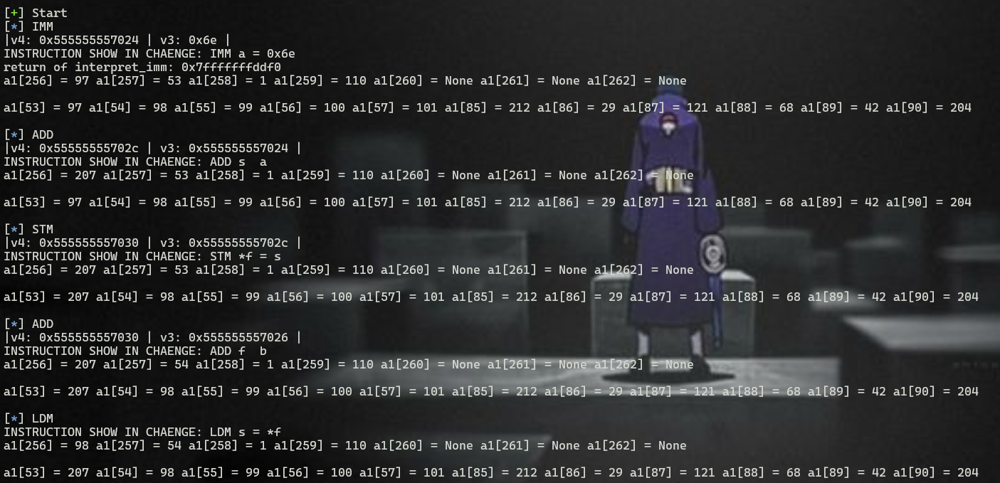

***Overall, it takes each bytes in my input and increases or decreases with the specified value.***

### [Script](https://github.com/BabyBroder/pwncollege/blob/Program-Security/Reverse-Engineering/src/level17_1.py)

# Level 18

## 18.0

***execute_program***
```cpp=
__int64 __fastcall execute_program(__int64 a1)
{
  _BOOL4 v2; // [rsp+1Ch] [rbp-4h]

  interpret_imm(a1, 4LL, 96LL);
  interpret_imm(a1, 1LL, 9LL);
  interpret_imm(a1, 32LL, 0LL);
  interpret_sys(a1, 2LL, 32LL);
  interpret_imm(a1, 4LL, 128LL);
  interpret_imm(a1, 1LL, 1LL);
  interpret_imm(a1, 32LL, 65LL);
  interpret_stm(a1, 4LL, 32LL);
  interpret_add(a1, 4LL, 1LL);
  interpret_imm(a1, 32LL, 87LL);
  interpret_stm(a1, 4LL, 32LL);
  interpret_add(a1, 4LL, 1LL);
  interpret_imm(a1, 32LL, 208LL);
  interpret_stm(a1, 4LL, 32LL);
  interpret_add(a1, 4LL, 1LL);
  interpret_imm(a1, 32LL, 192LL);
  interpret_stm(a1, 4LL, 32LL);
  interpret_add(a1, 4LL, 1LL);
  interpret_imm(a1, 32LL, 159LL);
  interpret_stm(a1, 4LL, 32LL);
  interpret_add(a1, 4LL, 1LL);
  interpret_imm(a1, 32LL, 211LL);
  interpret_stm(a1, 4LL, 32LL);
  interpret_add(a1, 4LL, 1LL);
  interpret_imm(a1, 32LL, 236LL);
  interpret_stm(a1, 4LL, 32LL);
  interpret_add(a1, 4LL, 1LL);
  interpret_imm(a1, 32LL, 57LL);
  interpret_stm(a1, 4LL, 32LL);
  interpret_add(a1, 4LL, 1LL);
  interpret_imm(a1, 32LL, 65LL);
  interpret_stm(a1, 4LL, 32LL);
  interpret_add(a1, 4LL, 1LL);
  interpret_imm(a1, 4LL, 128LL);
  interpret_ldm(a1, 4LL, 4LL);
  interpret_imm(a1, 1LL, 38LL);
  interpret_add(a1, 4LL, 1LL);
  interpret_imm(a1, 32LL, 96LL);
  interpret_ldm(a1, 32LL, 32LL);
  interpret_cmp(a1, 32LL, 4LL);
  v2 = (*(_BYTE *)(a1 + 262) & 0x10) != 0;
  interpret_imm(a1, 4LL, 129LL);
  interpret_ldm(a1, 4LL, 4LL);
  interpret_imm(a1, 1LL, 224LL);
  interpret_add(a1, 4LL, 1LL);
  interpret_imm(a1, 32LL, 97LL);
  interpret_ldm(a1, 32LL, 32LL);
  interpret_cmp(a1, 32LL, 4LL);
  if ( (*(_BYTE *)(a1 + 262) & 0x10) == 0 )
    v2 = 0;
  interpret_imm(a1, 4LL, 130LL);
  interpret_ldm(a1, 4LL, 4LL);
  interpret_imm(a1, 1LL, 194LL);
  interpret_add(a1, 4LL, 1LL);
  interpret_imm(a1, 32LL, 98LL);
  interpret_ldm(a1, 32LL, 32LL);
  interpret_cmp(a1, 32LL, 4LL);
  if ( (*(_BYTE *)(a1 + 262) & 0x10) == 0 )
    v2 = 0;
  interpret_imm(a1, 4LL, 131LL);
  interpret_ldm(a1, 4LL, 4LL);
  interpret_imm(a1, 1LL, 77LL);
  interpret_add(a1, 4LL, 1LL);
  interpret_imm(a1, 32LL, 99LL);
  interpret_ldm(a1, 32LL, 32LL);
  interpret_cmp(a1, 32LL, 4LL);
  if ( (*(_BYTE *)(a1 + 262) & 0x10) == 0 )
    v2 = 0;
  interpret_imm(a1, 4LL, 132LL);
  interpret_ldm(a1, 4LL, 4LL);
  interpret_imm(a1, 1LL, 76LL);
  interpret_add(a1, 4LL, 1LL);
  interpret_imm(a1, 32LL, 100LL);
  interpret_ldm(a1, 32LL, 32LL);
  interpret_cmp(a1, 32LL, 4LL);
  if ( (*(_BYTE *)(a1 + 262) & 0x10) == 0 )
    v2 = 0;
  interpret_imm(a1, 4LL, 133LL);
  interpret_ldm(a1, 4LL, 4LL);
  interpret_imm(a1, 1LL, 59LL);
  interpret_add(a1, 4LL, 1LL);
  interpret_imm(a1, 32LL, 101LL);
  interpret_ldm(a1, 32LL, 32LL);
  interpret_cmp(a1, 32LL, 4LL);
  if ( (*(_BYTE *)(a1 + 262) & 0x10) == 0 )
    v2 = 0;
  interpret_imm(a1, 4LL, 134LL);
  interpret_ldm(a1, 4LL, 4LL);
  interpret_imm(a1, 1LL, 120LL);
  interpret_add(a1, 4LL, 1LL);
  interpret_imm(a1, 32LL, 102LL);
  interpret_ldm(a1, 32LL, 32LL);
  interpret_cmp(a1, 32LL, 4LL);
  if ( (*(_BYTE *)(a1 + 262) & 0x10) == 0 )
    v2 = 0;
  interpret_imm(a1, 4LL, 135LL);
  interpret_ldm(a1, 4LL, 4LL);
  interpret_imm(a1, 1LL, 142LL);
  interpret_add(a1, 4LL, 1LL);
  interpret_imm(a1, 32LL, 103LL);
  interpret_ldm(a1, 32LL, 32LL);
  interpret_cmp(a1, 32LL, 4LL);
  if ( (*(_BYTE *)(a1 + 262) & 0x10) == 0 )
    v2 = 0;
  interpret_imm(a1, 4LL, 136LL);
  interpret_ldm(a1, 4LL, 4LL);
  interpret_imm(a1, 1LL, 131LL);
  interpret_add(a1, 4LL, 1LL);
  interpret_imm(a1, 32LL, 104LL);
  interpret_ldm(a1, 32LL, 32LL);
  interpret_cmp(a1, 32LL, 4LL);
  if ( (*(_BYTE *)(a1 + 262) & 0x10) == 0 )
    v2 = 0;
  interpret_imm(a1, 32LL, 1LL);
  interpret_imm(a1, 4LL, 0LL);
  interpret_imm(a1, 1LL, 1LL);
  if ( v2 )
  {
    interpret_imm(a1, 16LL, 67LL);
    interpret_stm(a1, 4LL, 16LL);
    interpret_sys(a1, 16LL, 32LL);
    interpret_imm(a1, 16LL, 79LL);
    interpret_stm(a1, 4LL, 16LL);
    interpret_sys(a1, 16LL, 32LL);
    interpret_imm(a1, 16LL, 82LL);
    interpret_stm(a1, 4LL, 16LL);
    interpret_sys(a1, 16LL, 32LL);
    interpret_imm(a1, 16LL, 82LL);
    interpret_stm(a1, 4LL, 16LL);
    interpret_sys(a1, 16LL, 32LL);
    interpret_imm(a1, 16LL, 69LL);
    interpret_stm(a1, 4LL, 16LL);
    interpret_sys(a1, 16LL, 32LL);
    interpret_imm(a1, 16LL, 67LL);
    interpret_stm(a1, 4LL, 16LL);
    interpret_sys(a1, 16LL, 32LL);
    interpret_imm(a1, 16LL, 84LL);
    interpret_stm(a1, 4LL, 16LL);
    interpret_sys(a1, 16LL, 32LL);
    interpret_imm(a1, 16LL, 33LL);
    interpret_stm(a1, 4LL, 16LL);
    interpret_sys(a1, 16LL, 32LL);
    interpret_imm(a1, 16LL, 32LL);
    interpret_stm(a1, 4LL, 16LL);
    interpret_sys(a1, 16LL, 32LL);
    interpret_imm(a1, 16LL, 89LL);
    interpret_stm(a1, 4LL, 16LL);
    interpret_sys(a1, 16LL, 32LL);
    interpret_imm(a1, 16LL, 111LL);
    interpret_stm(a1, 4LL, 16LL);
    interpret_sys(a1, 16LL, 32LL);
    interpret_imm(a1, 16LL, 117LL);
    interpret_stm(a1, 4LL, 16LL);
    interpret_sys(a1, 16LL, 32LL);
    interpret_imm(a1, 16LL, 114LL);
    interpret_stm(a1, 4LL, 16LL);
    interpret_sys(a1, 16LL, 32LL);
    interpret_imm(a1, 16LL, 32LL);
    interpret_stm(a1, 4LL, 16LL);
    interpret_sys(a1, 16LL, 32LL);
    interpret_imm(a1, 16LL, 102LL);
    interpret_stm(a1, 4LL, 16LL);
    interpret_sys(a1, 16LL, 32LL);
    interpret_imm(a1, 16LL, 108LL);
    interpret_stm(a1, 4LL, 16LL);
    interpret_sys(a1, 16LL, 32LL);
    interpret_imm(a1, 16LL, 97LL);
    interpret_stm(a1, 4LL, 16LL);
    interpret_sys(a1, 16LL, 32LL);
    interpret_imm(a1, 16LL, 103LL);
    interpret_stm(a1, 4LL, 16LL);
    interpret_sys(a1, 16LL, 32LL);
    interpret_imm(a1, 16LL, 58LL);
    interpret_stm(a1, 4LL, 16LL);
    interpret_sys(a1, 16LL, 32LL);
    interpret_imm(a1, 16LL, 10LL);
    interpret_stm(a1, 4LL, 16LL);
    interpret_sys(a1, 16LL, 32LL);
    interpret_imm(a1, 16LL, 47LL);
    interpret_imm(a1, 4LL, 0LL);
    interpret_stm(a1, 4LL, 16LL);
    interpret_imm(a1, 16LL, 102LL);
    interpret_imm(a1, 4LL, 1LL);
    interpret_stm(a1, 4LL, 16LL);
    interpret_imm(a1, 16LL, 108LL);
    interpret_imm(a1, 4LL, 2LL);
    interpret_stm(a1, 4LL, 16LL);
    interpret_imm(a1, 16LL, 97LL);
    interpret_imm(a1, 4LL, 3LL);
    interpret_stm(a1, 4LL, 16LL);
    interpret_imm(a1, 16LL, 103LL);
    interpret_imm(a1, 4LL, 4LL);
    interpret_stm(a1, 4LL, 16LL);
    interpret_imm(a1, 16LL, 0LL);
    interpret_imm(a1, 4LL, 5LL);
    interpret_stm(a1, 4LL, 16LL);
    interpret_imm(a1, 32LL, 0LL);
    interpret_imm(a1, 4LL, 0LL);
    interpret_sys(a1, 1LL, 32LL);
    interpret_imm(a1, 1LL, 100LL);
    interpret_sys(a1, 2LL, 1LL);
    interpret_imm(a1, 32LL, 1LL);
    interpret_sys(a1, 16LL, 1LL);
    interpret_imm(a1, 32LL, 0LL);
  }
  else
  {
    interpret_imm(a1, 16LL, 73LL);
    interpret_stm(a1, 4LL, 16LL);
    interpret_sys(a1, 16LL, 32LL);
    interpret_imm(a1, 16LL, 78LL);
    interpret_stm(a1, 4LL, 16LL);
    interpret_sys(a1, 16LL, 32LL);
    interpret_imm(a1, 16LL, 67LL);
    interpret_stm(a1, 4LL, 16LL);
    interpret_sys(a1, 16LL, 32LL);
    interpret_imm(a1, 16LL, 79LL);
    interpret_stm(a1, 4LL, 16LL);
    interpret_sys(a1, 16LL, 32LL);
    interpret_imm(a1, 16LL, 82LL);
    interpret_stm(a1, 4LL, 16LL);
    interpret_sys(a1, 16LL, 32LL);
    interpret_imm(a1, 16LL, 82LL);
    interpret_stm(a1, 4LL, 16LL);
    interpret_sys(a1, 16LL, 32LL);
    interpret_imm(a1, 16LL, 69LL);
    interpret_stm(a1, 4LL, 16LL);
    interpret_sys(a1, 16LL, 32LL);
    interpret_imm(a1, 16LL, 67LL);
    interpret_stm(a1, 4LL, 16LL);
    interpret_sys(a1, 16LL, 32LL);
    interpret_imm(a1, 16LL, 84LL);
    interpret_stm(a1, 4LL, 16LL);
    interpret_sys(a1, 16LL, 32LL);
    interpret_imm(a1, 16LL, 33LL);
    interpret_stm(a1, 4LL, 16LL);
    interpret_sys(a1, 16LL, 32LL);
    interpret_imm(a1, 32LL, 1LL);
  }
  interpret_imm(a1, 16LL, 10LL);
  interpret_stm(a1, 4LL, 16LL);
  interpret_sys(a1, 16LL, 32LL);
  return interpret_sys(a1, 8LL, 32LL);
}
```

- From line 5 too line 37: create license key
- In the every next stages, this function has the similar part
    - interpret_imm → interpret_ldm → interpret_imm → interpret_add → interpret_imm → interpret_ldm → interpret_cmp

The first part
```cpp=
interpret_imm(a1, 4LL, 128LL);
interpret_ldm(a1, 4LL, 4LL);
interpret_imm(a1, 1LL, 38LL);
interpret_add(a1, 4LL, 1LL);
interpret_imm(a1, 32LL, 96LL);
interpret_ldm(a1, 32LL, 32LL);
interpret_cmp(a1, 32LL, 4LL);
```

It does
```ccp=
//a1[257] = 128
interpret_imm(a1, 4, 128)

//index = a1[257] (=128)
//a1[257] = a1[index]
interpret_ldm(a1, 4, 4)

//a1[258] = 38
interpret_imm(a1, 1, 38)

//a1[257] += a1[258]
interpret_add(a1, 4, 1)

//a1[256] = 96
interpret_imm(a1, 32, 96)

//index  = a1[256]
//memory = a1[index]
//a1[256] = memory 
// ~~~ a1[256] = a1[96]
interpret_ldm(a1, 32, 32)

//compare a1[256] and a1[257]
interpret_cmp(a1, 32, 4)
```

### [Script](https://github.com/BabyBroder/pwncollege/blob/Program-Security/Reverse-Engineering/src/level18.py)


## 18.1

***execute_program***
```cpp=
__int64 __fastcall sub_198C(_BYTE *a1)
{
  _BOOL4 v2; // [rsp+1Ch] [rbp-4h]

  interpret_imm(a1, 32, 96);
  interpret_imm(a1, 16, 12);
  interpret_imm(a1, 1, 0);
  interpret_sys(a1, 32LL, 1LL);
  interpret_imm(a1, 32, 128);
  interpret_imm(a1, 16, 1);
  interpret_imm(a1, 1, 170);
  interpret_stm(a1, 32LL, 1LL);
  interpret_add(a1, 32LL, 16LL);
  interpret_imm(a1, 1, 150);
  interpret_stm(a1, 32LL, 1LL);
  interpret_add(a1, 32LL, 16LL);
  interpret_imm(a1, 1, 100);
  interpret_stm(a1, 32LL, 1LL);
  interpret_add(a1, 32LL, 16LL);
  interpret_imm(a1, 1, 106);
  interpret_stm(a1, 32LL, 1LL);
  interpret_add(a1, 32LL, 16LL);
  interpret_imm(a1, 1, 11);
  interpret_stm(a1, 32LL, 1LL);
  interpret_add(a1, 32LL, 16LL);
  interpret_imm(a1, 1, 238);
  interpret_stm(a1, 32LL, 1LL);
  interpret_add(a1, 32LL, 16LL);
  interpret_imm(a1, 1, 101);
  interpret_stm(a1, 32LL, 1LL);
  interpret_add(a1, 32LL, 16LL);
  interpret_imm(a1, 1, 9);
  interpret_stm(a1, 32LL, 1LL);
  interpret_add(a1, 32LL, 16LL);
  interpret_imm(a1, 1, 168);
  interpret_stm(a1, 32LL, 1LL);
  interpret_add(a1, 32LL, 16LL);
  interpret_imm(a1, 1, 33);
  interpret_stm(a1, 32LL, 1LL);
  interpret_add(a1, 32LL, 16LL);
  interpret_imm(a1, 1, 105);
  interpret_stm(a1, 32LL, 1LL);
  interpret_add(a1, 32LL, 16LL);
  interpret_imm(a1, 1, 8);
  interpret_stm(a1, 32LL, 1LL);
  interpret_add(a1, 32LL, 16LL);
  interpret_imm(a1, 32, 128);
  interpret_ldm(a1, 32LL, 32LL);
  interpret_imm(a1, 16, 17);
  interpret_add(a1, 32LL, 16LL);
  interpret_imm(a1, 1, 96);
  interpret_ldm(a1, 1LL, 1LL);
  interpret_cmp(a1, 1LL, 32LL);
  v2 = (a1[262] & 2) != 0;
  interpret_imm(a1, 32, 129);
  interpret_ldm(a1, 32LL, 32LL);
  interpret_imm(a1, 16, 1);
  interpret_add(a1, 32LL, 16LL);
  interpret_imm(a1, 1, 97);
  interpret_ldm(a1, 1LL, 1LL);
  interpret_cmp(a1, 1LL, 32LL);
  if ( (a1[262] & 2) == 0 )
    v2 = 0;
  interpret_imm(a1, 32, 130);
  interpret_ldm(a1, 32LL, 32LL);
  interpret_imm(a1, 16, 203);
  interpret_add(a1, 32LL, 16LL);
  interpret_imm(a1, 1, 98);
  interpret_ldm(a1, 1LL, 1LL);
  interpret_cmp(a1, 1LL, 32LL);
  if ( (a1[262] & 2) == 0 )
    v2 = 0;
  interpret_imm(a1, 32, 131);
  interpret_ldm(a1, 32LL, 32LL);
  interpret_imm(a1, 16, 195);
  interpret_add(a1, 32LL, 16LL);
  interpret_imm(a1, 1, 99);
  interpret_ldm(a1, 1LL, 1LL);
  interpret_cmp(a1, 1LL, 32LL);
  if ( (a1[262] & 2) == 0 )
    v2 = 0;
  interpret_imm(a1, 32, 132);
  interpret_ldm(a1, 32LL, 32LL);
  interpret_imm(a1, 16, 148);
  interpret_add(a1, 32LL, 16LL);
  interpret_imm(a1, 1, 100);
  interpret_ldm(a1, 1LL, 1LL);
  interpret_cmp(a1, 1LL, 32LL);
  if ( (a1[262] & 2) == 0 )
    v2 = 0;
  interpret_imm(a1, 32, 133);
  interpret_ldm(a1, 32LL, 32LL);
  interpret_imm(a1, 16, 157);
  interpret_add(a1, 32LL, 16LL);
  interpret_imm(a1, 1, 101);
  interpret_ldm(a1, 1LL, 1LL);
  interpret_cmp(a1, 1LL, 32LL);
  if ( (a1[262] & 2) == 0 )
    v2 = 0;
  interpret_imm(a1, 32, 134);
  interpret_ldm(a1, 32LL, 32LL);
  interpret_imm(a1, 16, 216);
  interpret_add(a1, 32LL, 16LL);
  interpret_imm(a1, 1, 102);
  interpret_ldm(a1, 1LL, 1LL);
  interpret_cmp(a1, 1LL, 32LL);
  if ( (a1[262] & 2) == 0 )
    v2 = 0;
  interpret_imm(a1, 32, 135);
  interpret_ldm(a1, 32LL, 32LL);
  interpret_imm(a1, 16, 84);
  interpret_add(a1, 32LL, 16LL);
  interpret_imm(a1, 1, 103);
  interpret_ldm(a1, 1LL, 1LL);
  interpret_cmp(a1, 1LL, 32LL);
  if ( (a1[262] & 2) == 0 )
    v2 = 0;
  interpret_imm(a1, 32, 136);
  interpret_ldm(a1, 32LL, 32LL);
  interpret_imm(a1, 16, 51);
  interpret_add(a1, 32LL, 16LL);
  interpret_imm(a1, 1, 104);
  interpret_ldm(a1, 1LL, 1LL);
  interpret_cmp(a1, 1LL, 32LL);
  if ( (a1[262] & 2) == 0 )
    v2 = 0;
  interpret_imm(a1, 32, 137);
  interpret_ldm(a1, 32LL, 32LL);
  interpret_imm(a1, 16, 199);
  interpret_add(a1, 32LL, 16LL);
  interpret_imm(a1, 1, 105);
  interpret_ldm(a1, 1LL, 1LL);
  interpret_cmp(a1, 1LL, 32LL);
  if ( (a1[262] & 2) == 0 )
    v2 = 0;
  interpret_imm(a1, 32, 138);
  interpret_ldm(a1, 32LL, 32LL);
  interpret_imm(a1, 16, 8);
  interpret_add(a1, 32LL, 16LL);
  interpret_imm(a1, 1, 106);
  interpret_ldm(a1, 1LL, 1LL);
  interpret_cmp(a1, 1LL, 32LL);
  if ( (a1[262] & 2) == 0 )
    v2 = 0;
  interpret_imm(a1, 32, 139);
  interpret_ldm(a1, 32LL, 32LL);
  interpret_imm(a1, 16, 41);
  interpret_add(a1, 32LL, 16LL);
  interpret_imm(a1, 1, 107);
  interpret_ldm(a1, 1LL, 1LL);
  interpret_cmp(a1, 1LL, 32LL);
  if ( (a1[262] & 2) == 0 )
    v2 = 0;
  interpret_imm(a1, 1, 1);
  interpret_imm(a1, 32, 0);
  interpret_imm(a1, 16, 1);
  if ( v2 )
  {
    interpret_imm(a1, 2, 67);
    interpret_stm(a1, 32LL, 2LL);
    interpret_sys(a1, 2LL, 1LL);
    interpret_imm(a1, 2, 79);
    interpret_stm(a1, 32LL, 2LL);
    interpret_sys(a1, 2LL, 1LL);
    interpret_imm(a1, 2, 82);
    interpret_stm(a1, 32LL, 2LL);
    interpret_sys(a1, 2LL, 1LL);
    interpret_imm(a1, 2, 82);
    interpret_stm(a1, 32LL, 2LL);
    interpret_sys(a1, 2LL, 1LL);
    interpret_imm(a1, 2, 69);
    interpret_stm(a1, 32LL, 2LL);
    interpret_sys(a1, 2LL, 1LL);
    interpret_imm(a1, 2, 67);
    interpret_stm(a1, 32LL, 2LL);
    interpret_sys(a1, 2LL, 1LL);
    interpret_imm(a1, 2, 84);
    interpret_stm(a1, 32LL, 2LL);
    interpret_sys(a1, 2LL, 1LL);
    interpret_imm(a1, 2, 33);
    interpret_stm(a1, 32LL, 2LL);
    interpret_sys(a1, 2LL, 1LL);
    interpret_imm(a1, 2, 32);
    interpret_stm(a1, 32LL, 2LL);
    interpret_sys(a1, 2LL, 1LL);
    interpret_imm(a1, 2, 89);
    interpret_stm(a1, 32LL, 2LL);
    interpret_sys(a1, 2LL, 1LL);
    interpret_imm(a1, 2, 111);
    interpret_stm(a1, 32LL, 2LL);
    interpret_sys(a1, 2LL, 1LL);
    interpret_imm(a1, 2, 117);
    interpret_stm(a1, 32LL, 2LL);
    interpret_sys(a1, 2LL, 1LL);
    interpret_imm(a1, 2, 114);
    interpret_stm(a1, 32LL, 2LL);
    interpret_sys(a1, 2LL, 1LL);
    interpret_imm(a1, 2, 32);
    interpret_stm(a1, 32LL, 2LL);
    interpret_sys(a1, 2LL, 1LL);
    interpret_imm(a1, 2, 102);
    interpret_stm(a1, 32LL, 2LL);
    interpret_sys(a1, 2LL, 1LL);
    interpret_imm(a1, 2, 108);
    interpret_stm(a1, 32LL, 2LL);
    interpret_sys(a1, 2LL, 1LL);
    interpret_imm(a1, 2, 97);
    interpret_stm(a1, 32LL, 2LL);
    interpret_sys(a1, 2LL, 1LL);
    interpret_imm(a1, 2, 103);
    interpret_stm(a1, 32LL, 2LL);
    interpret_sys(a1, 2LL, 1LL);
    interpret_imm(a1, 2, 58);
    interpret_stm(a1, 32LL, 2LL);
    interpret_sys(a1, 2LL, 1LL);
    interpret_imm(a1, 2, 10);
    interpret_stm(a1, 32LL, 2LL);
    interpret_sys(a1, 2LL, 1LL);
    interpret_imm(a1, 2, 47);
    interpret_imm(a1, 32, 0);
    interpret_stm(a1, 32LL, 2LL);
    interpret_imm(a1, 2, 102);
    interpret_imm(a1, 32, 1);
    interpret_stm(a1, 32LL, 2LL);
    interpret_imm(a1, 2, 108);
    interpret_imm(a1, 32, 2);
    interpret_stm(a1, 32LL, 2LL);
    interpret_imm(a1, 2, 97);
    interpret_imm(a1, 32, 3);
    interpret_stm(a1, 32LL, 2LL);
    interpret_imm(a1, 2, 103);
    interpret_imm(a1, 32, 4);
    interpret_stm(a1, 32LL, 2LL);
    interpret_imm(a1, 2, 0);
    interpret_imm(a1, 32, 5);
    interpret_stm(a1, 32LL, 2LL);
    interpret_imm(a1, 1, 0);
    interpret_imm(a1, 32, 0);
    interpret_sys(a1, 16LL, 1LL);
    interpret_imm(a1, 16, 100);
    interpret_sys(a1, 32LL, 16LL);
    interpret_imm(a1, 1, 1);
    interpret_sys(a1, 2LL, 16LL);
    interpret_imm(a1, 1, 0);
  }
  else
  {
    interpret_imm(a1, 2, 73);
    interpret_stm(a1, 32LL, 2LL);
    interpret_sys(a1, 2LL, 1LL);
    interpret_imm(a1, 2, 78);
    interpret_stm(a1, 32LL, 2LL);
    interpret_sys(a1, 2LL, 1LL);
    interpret_imm(a1, 2, 67);
    interpret_stm(a1, 32LL, 2LL);
    interpret_sys(a1, 2LL, 1LL);
    interpret_imm(a1, 2, 79);
    interpret_stm(a1, 32LL, 2LL);
    interpret_sys(a1, 2LL, 1LL);
    interpret_imm(a1, 2, 82);
    interpret_stm(a1, 32LL, 2LL);
    interpret_sys(a1, 2LL, 1LL);
    interpret_imm(a1, 2, 82);
    interpret_stm(a1, 32LL, 2LL);
    interpret_sys(a1, 2LL, 1LL);
    interpret_imm(a1, 2, 69);
    interpret_stm(a1, 32LL, 2LL);
    interpret_sys(a1, 2LL, 1LL);
    interpret_imm(a1, 2, 67);
    interpret_stm(a1, 32LL, 2LL);
    interpret_sys(a1, 2LL, 1LL);
    interpret_imm(a1, 2, 84);
    interpret_stm(a1, 32LL, 2LL);
    interpret_sys(a1, 2LL, 1LL);
    interpret_imm(a1, 2, 33);
    interpret_stm(a1, 32LL, 2LL);
    interpret_sys(a1, 2LL, 1LL);
    interpret_imm(a1, 1, 1);
  }
  interpret_imm(a1, 2, 10);
  interpret_stm(a1, 32LL, 2LL);
  interpret_sys(a1, 2LL, 1LL);
  return interpret_sys(a1, 4LL, 1LL);
}
```

- From line 5 too line 46: create license key
- In the every next stages, this function has the similar part
    - interpret_imm → interpret_ldm → interpret_imm → interpret_add → interpret_imm → interpret_ldm → interpret_cmp

The first part
```cpp=
interpret_imm(a1, 32, 128);
interpret_ldm(a1, 32LL, 32LL);
interpret_imm(a1, 16, 17);
interpret_add(a1, 32LL, 16LL);
interpret_imm(a1, 1, 96);
interpret_ldm(a1, 1LL, 1LL);
interpret_cmp(a1, 1LL, 32LL);
```

It does
```ccp=
//a1[257] = 128
interpret_imm(a1, 32, 128)

//index = a1[257] (=128)
///a1[257] = a1[index]
interpret_ldm(a1, 32, 32)

//a1[258] = 17
interpret_imm(a1, 16, 17)

//a1[257] += a1[258]
interpret_add(a1, 32, 16)

//a1[256] = 96
interpret_imm(a1, 1, 96)

//index  = a1[256]
//memory = a1[index]
//a1[256] = memory 
// ~~~ a1[256] = a1[96]
interpret_ldm(a1, 1, 1)

//compare a1[256] and a1[257]
interpret_cmp(a1, 1, 32)

```

### [Script](https://github.com/BabyBroder/pwncollege/blob/Program-Security/Reverse-Engineering/src/level18_1.py)

# Level 19

## 19.0

***main***
```cpp=
int __fastcall __noreturn main(int argc, const char **argv, const char **envp)
{
  __int64 dest[128]; // [rsp+10h] [rbp-410h] BYREF
  int v4; // [rsp+410h] [rbp-10h]
  __int16 v5; // [rsp+414h] [rbp-Ch]
  char v6; // [rsp+416h] [rbp-Ah]
  unsigned __int64 v7; // [rsp+418h] [rbp-8h]

  v7 = __readfsqword(0x28u);
  printf("[+] Welcome to %s!\n", *argv);
  puts("[+] This challenge is an custom emulator. It emulates a completely custom");
  puts("[+] architecture that we call \"Yan85\"! You'll have to understand the");
  puts("[+] emulator to understand the architecture, and you'll have to understand");
  puts("[+] the architecture to understand the code being emulated, and you will");
  puts("[+] have to understand that code to get the flag. Good luck!");
  puts("[+]");
  puts("[+] This level is a full Yan85 emulator. You'll have to reason about yancode,");
  puts("[+] and the implications of how the emulator interprets it!");
  setvbuf(stdout, 0LL, 2, 1uLL);
  memset(dest, 0, sizeof(dest));
  v4 = 0;
  v5 = 0;
  v6 = 0;
  memcpy(dest, &vm_code, (unsigned int)vm_code_length);
  dest[96] = vm_mem;
  dest[97] = qword_5328;
  dest[98] = qword_5330;
  dest[99] = qword_5338;
  dest[100] = qword_5340;
  dest[101] = qword_5348;
  dest[102] = qword_5350;
  dest[103] = qword_5358;
  dest[104] = qword_5360;
  dest[105] = qword_5368;
  dest[106] = qword_5370;
  dest[107] = qword_5378;
  dest[108] = qword_5380;
  dest[109] = qword_5388;
  dest[110] = qword_5390;
  dest[111] = qword_5398;
  dest[112] = qword_53A0;
  dest[113] = qword_53A8;
  dest[114] = qword_53B0;
  dest[115] = qword_53B8;
  dest[116] = qword_53C0;
  dest[117] = qword_53C8;
  dest[118] = qword_53D0;
  dest[119] = qword_53D8;
  dest[120] = qword_53E0;
  dest[121] = qword_53E8;
  dest[122] = qword_53F0;
  dest[123] = qword_53F8;
  dest[124] = qword_5400;
  dest[125] = qword_5408;
  dest[126] = qword_5410;
  dest[127] = qword_5418;
  interpreter_loop(dest);
}
```

It copies vm_code into dest after calling memset(make dest 0).

- 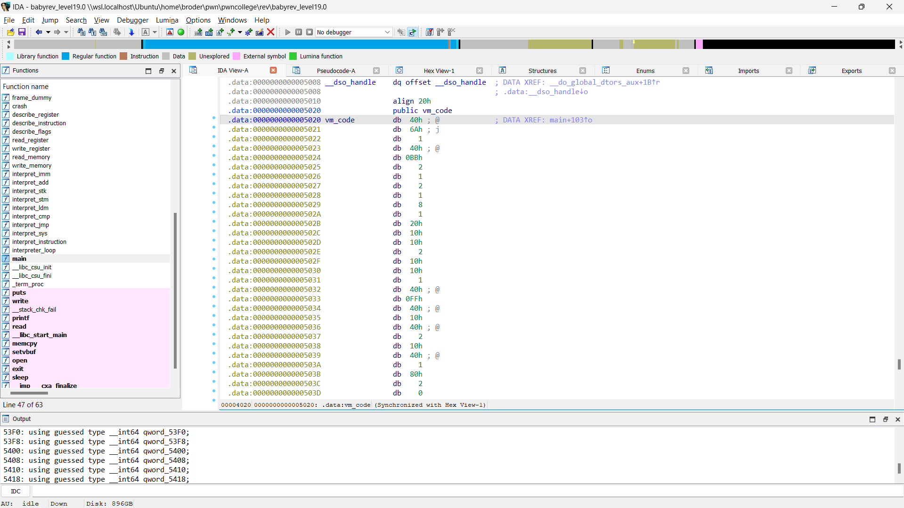

    - As you see, vm_code includes many bytes as the instruction byte for this program.

- 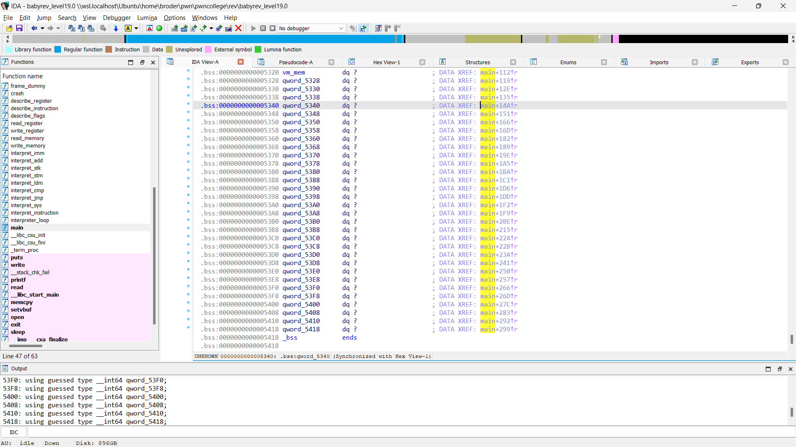

    - vm_mem has the unknown byte, so I check it in pwndbg
    
        - 


***interpreter_loop***
```cpp=
void __fastcall __noreturn interpreter_loop(__int64 a1)
{
  unsigned __int8 v1; // al

  puts("[+] Starting interpreter loop! Good luck!");
  while ( 1 )
  {
    v1 = *(_BYTE *)(a1 + 1029);
    *(_BYTE *)(a1 + 1029) = v1 + 1;
    interpret_instruction(
      a1,
      *(unsigned __int16 *)(a1 + 3LL * v1) | ((unsigned __int64)*(unsigned __int8 *)(a1 + 3LL * v1 + 2) << 16));
  }
}
```

***interpret_instruction***
```cpp=
__int64 __fastcall interpret_instruction(unsigned __int8 *a1, __int64 a2)
{
  __int64 result; // rax

  printf(
    "[V] a:%#hhx b:%#hhx c:%#hhx d:%#hhx s:%#hhx i:%#hhx f:%#hhx\n",
    a1[1024],
    a1[1025],
    a1[1026],
    a1[1027],
    a1[1028],
    a1[1029],
    a1[1030]);
  printf("[I] op:%#hhx arg1:%#hhx arg2:%#hhx\n", (unsigned __int8)a2, BYTE2(a2), BYTE1(a2));
  if ( (a2 & 0x40) != 0 )
    interpret_imm(a1, a2);
  if ( (a2 & 0x10) != 0 )
    interpret_add(a1, a2);
  if ( (a2 & 0x80u) != 0LL )
    interpret_stk(a1, a2);
  if ( (a2 & 1) != 0 )
    interpret_stm(a1, a2);
  if ( (a2 & 8) != 0 )
    interpret_ldm(a1, a2);
  if ( (a2 & 0x20) != 0 )
    interpret_cmp(a1, a2);
  if ( (a2 & 2) != 0 )
    interpret_jmp(a1, a2);
  result = a2 & 4;
  if ( (a2 & 4) != 0 )
    return interpret_sys(a1, a2);
  return result;
}
```

It takes the byte instruction to call the respective function.

***The big difference in this level is that the program doesn't give the code.***

I spent many times thinking about the approach to solving this level and writing a script for it.


### [Script DEBUG](https://github.com/BabyBroder/pwncollege/blob/Program-Security/Reverse-Engineering/src/level19_DEBUG.py)

```antlr4=
[+] v1 @ 0xb6
[+] x | y @ 0x204004
[V] a:0x0 b:0x30 c:0xe d:0x1 s:0x8 i:0xb7 f:0x0
[I] op:0x4 arg1:0x20 arg2:0x40
[*] SYS
[s] SYS 0x20 d
[s] ... read_memory
input: aa
[s] ... return value (in register d): 0x2

a1[1024] = 0x0 a1[1025] = 0x30 a1[1026] = 0xe a1[1027] = 0x2 a1[1028] = 0x8 a1[1029] = 0xb7 a1[1030] = 0x0 a1[1031] = 0x0 a1[1032] = 0x0 a1[1033] = 0x0

0x204004
index = a1[1025] = 0x30
a1[index + 768] = a1[816] = input
```


***Sent byte: aaaa***

```antlr4=
[+] v1 @ 0x6
[+] x | y @ 0x40ff40
[V] a:0x3c b:0x79 c:0xc d:0x95 s:0x6 i:0x7 f:0x0
[I] op:0x40 arg1:0x40 arg2:0xff
[*] IMM
IMM d = 0xff
a1[1024] = 0x3c a1[1025] = 0x79 a1[1026] = 0xc a1[1027] = 0xff a1[1028] = 0x6 a1[1029] = 0x7 a1[1030] = 0x0 a1[1031] = 0x0 a1[1032] = 0x0 a1[1033] = 0x0

0x40ff40
		=> a1[1027] = 0xff


[+] v1 @ 0x7
[+] x | y @ 0x24010
[V] a:0x3c b:0x79 c:0xc d:0xff s:0x6 i:0x8 f:0x0
[I] op:0x10 arg1:0x2 arg2:0x40
[*] ADD
[s] ADD a  d
a1[1024] = 0x3b a1[1025] = 0x79 a1[1026] = 0xc a1[1027] = 0xff a1[1028] = 0x6 a1[1029] = 0x8 a1[1030] = 0x0 a1[1031] = 0x0 a1[1032] = 0x0 a1[1033] = 0x0

0x24010
v2 = a1[1024] = 0x3c
v4 = a1[1027] = 0xff
a1[1024] = v2 + v4 = 0x3b

		=> a1[1024] += a1[1027]


[+] v1 @ 0x8
[+] x | y @ 0x14010
[V] a:0x3b b:0x79 c:0xc d:0xff s:0x6 i:0x9 f:0x0
[I] op:0x10 arg1:0x1 arg2:0x40
[*] ADD
[s] ADD b  d
a1[1024] = 0x3b a1[1025] = 0x78 a1[1026] = 0xc a1[1027] = 0xff a1[1028] = 0x6 a1[1029] = 0x9 a1[1030] = 0x0 a1[1031] = 0x0 a1[1032] = 0x0 a1[1033] = 0x0

0x14010
v2 = a1[1025] = 0x78
v4 = a1[1027] = 0xff 
a1[1024] = v2 + v4 = 0x78

		=> a1[1025] += a1[1027]

[+] v1 @ 0x9
[+] x | y @ 0x280
[V] a:0x3b b:0x78 c:0xc d:0xff s:0x6 i:0xa f:0x0
[I] op:0x80 arg1:0x0 arg2:0x2
[*] STK
[s] STK N  a
[s] ... pushing a
a1[1024] = 0x3b a1[1025] = 0x78 a1[1026] = 0xc a1[1027] = 0xff a1[1028] = 0x7 a1[1029] = 0xa a1[1030] = 0x0 a1[1031] = 0x0 a1[1032] = 0x0 a1[1033] = 0x0

0x000280
a1[2018]++
v5 = a1[1024] = 0x3b
index = a1[2018] = 0x7
a1[index + 768] = v5
		=> a1[775] = a1[1024] = 0x3b


[+] v1 @ 0xa
[+] x | y @ 0x180
[V] a:0x3b b:0x78 c:0xc d:0xff s:0x7 i:0xb f:0x0
[I] op:0x80 arg1:0x0 arg2:0x1
[*] STK
[s] STK N  b
[s] ... pushing b
a1[1024] = 0x3b a1[1025] = 0x78 a1[1026] = 0xc a1[1027] = 0xff a1[1028] = 0x8 a1[1029] = 0xb a1[1030] = 0x0 a1[1031] = 0x0 a1[1032] = 0x0 a1[1033] = 0x0

0x000180
a1[2018]++
v5 = a1[1025] = 0x78
index = a1[2018] = 0x8
a1[index + 768] = v5
		=> a1[776] = a1[1025] = 0x78


[+] v1 @ 0xb
[+] x | y @ 0x20208
[V] a:0x3b b:0x78 c:0xc d:0xff s:0x8 i:0xc f:0x0
[I] op:0x8 arg1:0x2 arg2:0x2
[*] LDM
[s] LDM a = *a
[*] v4 @ 0x3b
[*] memory @ 0x0
a1[1024] = 0x0 a1[1025] = 0x78 a1[1026] = 0xc a1[1027] = 0xff a1[1028] = 0x8 a1[1029] = 0xc a1[1030] = 0x0 a1[1031] = 0x0 a1[1032] = 0x0 a1[1033] = 0x0

0x020208
v4 = a1[1024] = 0x3b
memory = a1[v4 + 768] = a1[827] = 0x0
a1[1024] = memory

		=> a1[1024] = a1[827]

[+] v1 @ 0xc
[+] x | y @ 0x10108
[V] a:0x0 b:0x78 c:0xc d:0xff s:0x8 i:0xd f:0x0
[I] op:0x8 arg1:0x1 arg2:0x1
[*] LDM
[s] LDM b = *b
[*] v4 @ 0x78
[*] memory @ 0x45
a1[1024] = 0x0 a1[1025] = 0x45 a1[1026] = 0xc a1[1027] = 0xff a1[1028] = 0x8 a1[1029] = 0xd a1[1030] = 0x0 a1[1031] = 0x0 a1[1032] = 0x0 a1[1033] = 0x0

0x010108
v4 = a1[1025] = 0x78
memory = a1[v4 + 768] = a1[888] = 0x45
a1[1025] = memory 

		=> a1[1025] = a1[888]

[+] v1 @ 0xd
[+] x | y @ 0x20120
[V] a:0x0 b:0x45 c:0xc d:0xff s:0x8 i:0xe f:0x0
[I] op:0x20 arg1:0x2 arg2:0x1
[*] CMP
[s] CMP a = b
a1[1024] = 0x0 a1[1025] = 0x45 a1[1026] = 0xc a1[1027] = 0xff a1[1028] = 0x8 a1[1029] = 0xe a1[1030] = 0x12 a1[1031] = 0x0 a1[1032] = 0x0 a1[1033] = 0x0

0x020120

```

**compare a1[1024] and a1[1025]**

		=> compare a1[827]( ~ input[12]) and a1[888] = 0x45

```antlr4=
[+] v1 @ 0xe
[+] x | y @ 0x10080
[V] a:0x0 b:0x45 c:0xc d:0xff s:0x8 i:0xf f:0x12
[I] op:0x80 arg1:0x1 arg2:0x0
[*] STK
[s] STK b  N
[s] ... popping b
a1[1024] = 0x0 a1[1025] = 0x78 a1[1026] = 0xc a1[1027] = 0xff a1[1028] = 0x7 a1[1029] = 0xf a1[1030] = 0x12 a1[1031] = 0x0 a1[1032] = 0x0 a1[1033] = 0x0

0x10080
index = a1[1028] = 0x8
memory = a1[index + 768] = a1[776] = 0x78
a1[1025] = memory = 0x78
a1[1028]--

		=> a1[1025] = a1[776]


[+] v1 @ 0xf
[+] x | y @ 0x20080
[V] a:0x0 b:0x78 c:0xc d:0xff s:0x7 i:0x10 f:0x12
[I] op:0x80 arg1:0x2 arg2:0x0
[*] STK
[s] STK a  N
[s] ... popping a
a1[1024] = 0x3b a1[1025] = 0x78 a1[1026] = 0xc a1[1027] = 0xff a1[1028] = 0x6 a1[1029] = 0x10 a1[1030] = 0x12 a1[1031] = 0x0 a1[1032] = 0x0 a1[1033] = 0x0

0x20080
index = a1[1028] = 0x7
memory = a1[index + 768] = a1[775] = 0x3b
a1[1024] = memory = 0x3b
a1[1028]--

		=> a1[1024] = a1[775]


[+] v1 @ 0x10
[+] x | y @ 0x401840
[V] a:0x3b b:0x78 c:0xc d:0xff s:0x6 i:0x11 f:0x12
[I] op:0x40 arg1:0x40 arg2:0x18
[*] IMM
IMM d = 0x18
a1[1024] = 0x3b a1[1025] = 0x78 a1[1026] = 0xc a1[1027] = 0x18 a1[1028] = 0x6 a1[1029] = 0x11 a1[1030] = 0x12 a1[1031] = 0x0 a1[1032] = 0x0 a1[1033] = 0x0

0x401840
		=> a1[1027] = 0x18 

[+] v1 @ 0x11
[+] x | y @ 0x104002
[V] a:0x3b b:0x78 c:0xc d:0x18 s:0x6 i:0x12 f:0x12
[I] op:0x2 arg1:0x10 arg2:0x40
[*] JMP
[j] JMP N\x00 d
[j] ... TAKEN
a1[1024] = 0x3b a1[1025] = 0x78 a1[1026] = 0xc a1[1027] = 0x18 a1[1028] = 0x6 a1[1029] = 0x18 a1[1030] = 0x12 a1[1031] = 0x0 a1[1032] = 0x0 a1[1033] = 0x0

0x104002

result = a1[1027] = 0x18
a1[1029] = result

		=> a1[1029] = a1[1027]

[+] v1 @ 0x18
[+] x | y @ 0x401080
[V] a:0x3b b:0x78 c:0xc d:0x18 s:0x6 i:0x19 f:0x12
[I] op:0x80 arg1:0x40 arg2:0x10
[*] STK
[s] STK d  c
[s] ... pushing c
[s] ... popping d
a1[1024] = 0x3b a1[1025] = 0x78 a1[1026] = 0xc a1[1027] = 0xc a1[1028] = 0x6 a1[1029] = 0x19 a1[1030] = 0x12 a1[1031] = 0x0 a1[1032] = 0x0 a1[1033] = 0x0


0x401080

pushing:
a1[1028]++
v5 = a1[1026] = 0xc
index = a1[1028] = 0x7
a1[index + 768] = a1[775] = v5 
	=> a1[775] = a1[1026]

popping
index = a1[1028] = 0x7
memory = a1[index + 768] = a1[775]
a1[1027] = memory 
a1[1028]--
	=> a1[1027] = a1[775]

		=> a1[1027] = a1[1026]

[+] v1 @ 0x19
[+] x | y @ 0x200080
[V] a:0x3b b:0x78 c:0xc d:0xc s:0x6 i:0x1a f:0x12
[I] op:0x80 arg1:0x20 arg2:0x0
[*] STK
[s] STK i  N
[s] ... popping i
a1[1024] = 0x3b a1[1025] = 0x78 a1[1026] = 0xc a1[1027] = 0xc a1[1028] = 0x5 a1[1029] = 0x95 a1[1030] = 0x12 a1[1031] = 0x0 a1[1032] = 0x0 a1[1033] = 0x0

0x200080
index = a1[1028]
memory = a1[index + 768] = a1[774] = 0x95
a1[1029] = memory
		=> a1[1029] = a1[774] = 0x95


[+] v1 @ 0x95
[+] x | y @ 0x100040
[V] a:0x3b b:0x78 c:0xc d:0xc s:0x5 i:0x96 f:0x12
[I] op:0x40 arg1:0x10 arg2:0x0
[*] IMM
IMM c = 0x0
a1[1024] = 0x3b a1[1025] = 0x78 a1[1026] = 0x0 a1[1027] = 0xc a1[1028] = 0x5 a1[1029] = 0x96 a1[1030] = 0x12 a1[1031] = 0x0 a1[1032] = 0x0 a1[1033] = 0x0

0x100040
		=> a1[1026] = 0x0

[+] v1 @ 0x96
[+] x | y @ 0x401020
[V] a:0x3b b:0x78 c:0x0 d:0xc s:0x5 i:0x97 f:0x12
[I] op:0x20 arg1:0x40 arg2:0x10
[*] CMP
[s] CMP d = c
a1[1024] = 0x3b a1[1025] = 0x78 a1[1026] = 0x0 a1[1027] = 0xc a1[1028] = 0x5 a1[1029] = 0x97 a1[1030] = 0x14 a1[1031] = 0x0 a1[1032] = 0x0 a1[1033] = 0x0

0x401020
		=>compare a1[1026] and a1[1027]
```

However, this program make` a1[1026] = 0x0` and `a1[1027]` is equal to the old value of `a1[1026]`(force `a1[1026] = 0xc` ~ `IMM c = 0xc`)

I don't think what does this compare mean? Thus, I try to pass the first compare and see the result


    Sent byte: aaaaaaaaaaaE
    
```antlr4=
[+] v1 @ 0x16
[+] x | y @ 0x400640
[V] a:0x3b b:0x78 c:0xb d:0x0 s:0x6 i:0x17 f:0x14
[I] op:0x40 arg1:0x40 arg2:0x6
[*] IMM
IMM d = 0x6
a1[1024] = 0x3b a1[1025] = 0x78 a1[1026] = 0xb a1[1027] = 0x6 a1[1028] = 0x6 a1[1029] = 0x17 a1[1030] = 0x14 a1[1031] = 0x0 a1[1032] = 0x0 a1[1033] = 0x0

0x400640
        => a1[1027] = 0x6

[+] v1 @ 0x17
[+] x | y @ 0x104002
[V] a:0x3b b:0x78 c:0xb d:0x6 s:0x6 i:0x18 f:0x14
[I] op:0x2 arg1:0x10 arg2:0x40
[*] JMP
[j] JMP N\x00 d
[j] ... TAKEN
a1[1024] = 0x3b a1[1025] = 0x78 a1[1026] = 0xb a1[1027] = 0x6 a1[1028] = 0x6 a1[1029] = 0x6 a1[1030] = 0x14 a1[1031] = 0x0 a1[1032] = 0x0 a1[1033] = 0x0

result = a1[1027] = 0x6
a1[1029] = a1[1027]
        => a1[1029] = a1[1027]

[+] v1 @ 0x6
[+] x | y @ 0x40ff40
[V] a:0x3b b:0x78 c:0xb d:0x6 s:0x6 i:0x7 f:0x14
[I] op:0x40 arg1:0x40 arg2:0xff
[*] IMM
IMM d = 0xff
a1[1024] = 0x3b a1[1025] = 0x78 a1[1026] = 0xb a1[1027] = 0xff a1[1028] = 0x6 a1[1029] = 0x7 a1[1030] = 0x14 a1[1031] = 0x0 a1[1032] = 0x0 a1[1033] = 0x0

0x40ff40
        => a1[1027] = 0xff

[+] v1 @ 0x7
[+] x | y @ 0x24010
[V] a:0x3b b:0x78 c:0xb d:0xff s:0x6 i:0x8 f:0x14
[I] op:0x10 arg1:0x2 arg2:0x40
[*] ADD
[s] ADD a  d
a1[1024] = 0x3a a1[1025] = 0x78 a1[1026] = 0xb a1[1027] = 0xff a1[1028] = 0x6 a1[1029] = 0x8 a1[1030] = 0x14 a1[1031] = 0x0 a1[1032] = 0x0 a1[1033] = 0x0

0x24010
v2 = a1[1024] = 0x3a
v4 = a1[1027] = 0xff
a1[1024] = v2 + v4
        => a1[1024] += a1[1027]

[+] v1 @ 0x8
[+] x | y @ 0x14010
[V] a:0x3a b:0x78 c:0xb d:0xff s:0x6 i:0x9 f:0x14
[I] op:0x10 arg1:0x1 arg2:0x40
[*] ADD
[s] ADD b  d
a1[1024] = 0x3a a1[1025] = 0x77 a1[1026] = 0xb a1[1027] = 0xff a1[1028] = 0x6 a1[1029] = 0x9 a1[1030] = 0x14 a1[1031] = 0x0 a1[1032] = 0x0 a1[1033] = 0x0

0x14010
v2 = a1[1025] = 0x3a
v4 = a1[1027] = 0xff
a1[1025] = v2 + v4
        => a1[1025] += a1[1027]


[+] v1 @ 0x9
[+] x | y @ 0x280
[V] a:0x3a b:0x77 c:0xb d:0xff s:0x6 i:0xa f:0x14
[I] op:0x80 arg1:0x0 arg2:0x2
[*] STK
[s] STK N  a
[s] ... pushing a
a1[1024] = 0x3a a1[1025] = 0x77 a1[1026] = 0xb a1[1027] = 0xff a1[1028] = 0x7 a1[1029] = 0xa a1[1030] = 0x14 a1[1031] = 0x0 a1[1032] = 0x0 a1[1033] = 0x0

0x000280
a1[1028]++
v5 = a1[1024] = 0x3a
index = a1[1028]
a1[index + 768] = a1[775] = v5

          => a1[775] = a1[1024]

[+] v1 @ 0xa
[+] x | y @ 0x180
[V] a:0x3a b:0x77 c:0xb d:0xff s:0x7 i:0xb f:0x14
[I] op:0x80 arg1:0x0 arg2:0x1
[*] STK
[s] STK N  b
[s] ... pushing b
a1[1024] = 0x3a a1[1025] = 0x77 a1[1026] = 0xb a1[1027] = 0xff a1[1028] = 0x8 a1[1029] = 0xb a1[1030] = 0x14 a1[1031] = 0x0 a1[1032] = 0x0 a1[1033] = 0x0


0x000180
a1[1028]++
v5 = a1[1025] = 0x77
index = a1[1028]
a1[index + 768] = a1[776] = v5

          => a1[776] = a1[1024]


[+] v1 @ 0xb
[+] x | y @ 0x20208
[V] a:0x3a b:0x77 c:0xb d:0xff s:0x8 i:0xc f:0x14
[I] op:0x8 arg1:0x2 arg2:0x2
[*] LDM
[s] LDM a = *a
[*] v4 @ 0x3a
[*] memory @ 0x61
a1[1024] = 0x61 a1[1025] = 0x77 a1[1026] = 0xb a1[1027] = 0xff a1[1028] = 0x8 a1[1029] = 0xc a1[1030] = 0x14 a1[1031] = 0x0 a1[1032] = 0x0 a1[1033] = 0x0

0x20208
v4 =  a1[1024] = 0x3a
memory = a1[v4 + 768]= a1[826]
a1[1024] = memory 
        => a1[1024] = a1[826]


[+] v1 @ 0xc
[+] x | y @ 0x10108
[V] a:0x61 b:0x77 c:0xb d:0xff s:0x8 i:0xd f:0x14
[I] op:0x8 arg1:0x1 arg2:0x1
[*] LDM
[s] LDM b = *b
[*] v4 @ 0x77
[*] memory @ 0xbb
a1[1024] = 0x61 a1[1025] = 0xbb a1[1026] = 0xb a1[1027] = 0xff a1[1028] = 0x8 a1[1029] = 0xd a1[1030] = 0x14 a1[1031] = 0x0 a1[1032] = 0x0 a1[1033] = 0x0

0x10108
v4 = a1[1025] = 0x77
memory = a1[v4 + 768] = a1[887]
        => a1[1025] = a1[888]


[+] v1 @ 0xd
[+] x | y @ 0x20120
[V] a:0x61 b:0xbb c:0xb d:0xff s:0x8 i:0xe f:0x14
[I] op:0x20 arg1:0x2 arg2:0x1
[*] CMP
[s] CMP a = b
a1[1024] = 0x61 a1[1025] = 0xbb a1[1026] = 0xb a1[1027] = 0xff a1[1028] = 0x8 a1[1029] = 0xe a1[1030] = 0x12 a1[1031] = 0x0 a1[1032] = 0x0 a1[1033] = 0x0

compare a1[1024] and a1[1025]
<=> compare a1[826] and a1[887]
```

Here, I will conclude my supposition and guess the work of compare.

- First, it will compare the index 12 of my input(a1[827]) with the respective byte(a1[888])

- Next, it compares something couple of value(I don't know what does this mean? I guess it will make the instruction for the next compare)

- Then, it compares the similar couple, but index subtract 1 (a1[826] and a1[887])

- And, the next unknown compare happens

- This loop is has the rule, I follow with this and have the license key.

### [Script](https://github.com/BabyBroder/pwncollege/blob/Program-Security/Reverse-Engineering/src/level19.py)

## 19.1 

### [Script DEBUG](https://github.com/BabyBroder/pwncollege/blob/Program-Security/Reverse-Engineering/src/level19_1_DEBUG.py)

### [Script](https://github.com/BabyBroder/pwncollege/blob/Program-Security/Reverse-Engineering/src/level19_1.py)

# Level 20 

## 20.0

In this level, vm_mem is not empty.

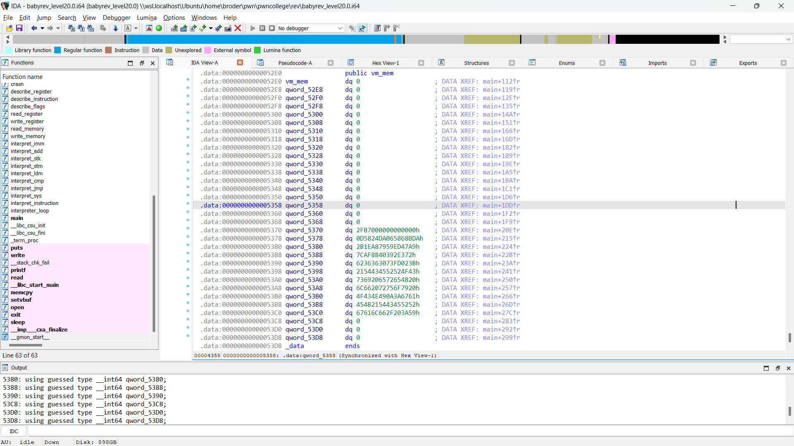


### [Script DEBUG](https://github.com/BabyBroder/pwncollege/blob/Program-Security/Reverse-Engineering/src/level20_DEBUG.py) 
```antlr4=
[+] v1 @ 0xdc
[+] x | y @ 0x18004
[V] a:0x0 b:0x30 c:0x22 d:0x5 s:0x3 i:0xdd f:0x0
[I] op:0x80 arg1:0x4 arg2:0x1
[*] SYS
[s] SYS 0x4 d
[s] ... read_memory
input: aaaaaaaaaaaaaaaaaaaaaaaaaaaa
[s] ... return value (in register d): 0x1c

a1[1024] = 0x0 a1[1025] = 0x30 a1[1026] = 0x22 a1[1027] = 0x1c a1[1028] = 0x3 a1[1029] = 0xdd a1[1030] = 0x0 a1[1031] = 0x0 a1[1032] = 0x0 a1[1033] = 0x0
```
  input at index a1[768 + 0x30] ~ a1[816]

```antlr4=

[+] v1 @ 0x3
[+] x | y @ 0xff0801
[V] a:0x4c b:0xb8 c:0x1c d:0xc6 s:0x1 i:0x4 f:0x0
[I] op:0x8 arg1:0x1 arg2:0xff
[*] IMM
IMM d = 0xff
a1[1024] = 0x4c a1[1025] = 0xb8 a1[1026] = 0x1c a1[1027] = 0xff a1[1028] = 0x1 a1[1029] = 0x4 a1[1030] = 0x0 a1[1031] = 0x0 a1[1032] = 0x0 a1[1033] = 0x0

        => a1[1027] = 0xff

[+] v1 @ 0x4
[+] x | y @ 0x14010
[V] a:0x4c b:0xb8 c:0x1c d:0xff s:0x1 i:0x5 f:0x0
[I] op:0x40 arg1:0x10 arg2:0x1
[*] ADD
[s] ADD a  d
a1[1024] = 0x4b a1[1025] = 0xb8 a1[1026] = 0x1c a1[1027] = 0xff a1[1028] = 0x1 a1[1029] = 0x5 a1[1030] = 0x0 a1[1031] = 0x0 a1[1032] = 0x0 a1[1033] = 0x0

v2 = a1[1024] = 0x4b
v4 = a1[1027] = 0xff
a1[1024] = v2 + v4

        => a1[1024] += a1[1027]

[+] v1 @ 0x5
[+] x | y @ 0x14002
[V] a:0x4b b:0xb8 c:0x1c d:0xff s:0x1 i:0x6 f:0x0
[I] op:0x40 arg1:0x2 arg2:0x1
[*] ADD
[s] ADD b  d
a1[1024] = 0x4b a1[1025] = 0xb7 a1[1026] = 0x1c a1[1027] = 0xff a1[1028] = 0x1 a1[1029] = 0x6 a1[1030] = 0x0 a1[1031] = 0x0 a1[1032] = 0x0 a1[1033] = 0x0

v2 = a1[1025] = 0xb7
v4 = a1[1027] = 0xff
a1[1025] = v2 + v4

        => a1[1025] += a1[1027]

[+] v1 @ 0x6
[+] x | y @ 0x100200
[V] a:0x4b b:0xb7 c:0x1c d:0xff s:0x1 i:0x7 f:0x0
[I] op:0x2 arg1:0x0 arg2:0x10
[*] STK
[s] STK N  a
[s] ... pushing a
a1[1024] = 0x4b a1[1025] = 0xb7 a1[1026] = 0x1c a1[1027] = 0xff a1[1028] = 0x2 a1[1029] = 0x7 a1[1030] = 0x0 a1[1031] = 0x0 a1[1032] = 0x0 a1[1033] = 0x0

a1[1028]++
v5 = a1[1024] = 0x4b
index = a1[1028]
a1[index + 768] = v5

        => a1[770] = 0x4b

[+] v1 @ 0x7
[+] x | y @ 0x20200
[V] a:0x4b b:0xb7 c:0x1c d:0xff s:0x2 i:0x8 f:0x0
[I] op:0x2 arg1:0x0 arg2:0x2
[*] STK
[s] STK N  b
[s] ... pushing b
a1[1024] = 0x4b a1[1025] = 0xb7 a1[1026] = 0x1c a1[1027] = 0xff a1[1028] = 0x3 a1[1029] = 0x8 a1[1030] = 0x0 a1[1031] = 0x0 a1[1032] = 0x0 a1[1033] = 0x0


a1[1028]++
v5 = a1[1025] = 0xb7
index = a1[1028]
a1[index + 768] = v5

        => a1[771] = 0x4b

[+] v1 @ 0x8
[+] x | y @ 0x102010
[V] a:0x4b b:0xb7 c:0x1c d:0xff s:0x3 i:0x9 f:0x0
[I] op:0x20 arg1:0x10 arg2:0x10
[*] LDM
[s] LDM a = *a
[*] v4 @ 0x4b
[*] memory @ 0x7
a1[1024] = 0x7 a1[1025] = 0xb7 a1[1026] = 0x1c a1[1027] = 0xff a1[1028] = 0x3 a1[1029] = 0x9 a1[1030] = 0x0 a1[1031] = 0x0 a1[1032] = 0x0 a1[1033] = 0x0

v4 = a1[1024] = 0x4b
memory = a1[768 +v4] = a1[843]
a1[1024] = memory

        => a1[1024] = a1[843]

[+] v1 @ 0x9
[+] x | y @ 0x22002
[V] a:0x7 b:0xb7 c:0x1c d:0xff s:0x3 i:0xa f:0x0
[I] op:0x20 arg1:0x2 arg2:0x2
[*] LDM
[s] LDM b = *b
[*] v4 @ 0xb7
[*] memory @ 0x62
a1[1024] = 0x7 a1[1025] = 0x62 a1[1026] = 0x1c a1[1027] = 0xff a1[1028] = 0x3 a1[1029] = 0xa a1[1030] = 0x0 a1[1031] = 0x0 a1[1032] = 0x0 a1[1033] = 0x0

v4 = a1[1025] = 0xb7
memory = a1[768 +v4] = a1[951]
a1[1024] = memory

        => a1[1025] = a1[951]

[+] v1 @ 0xa
[+] x | y @ 0x20410
[V] a:0x7 b:0x62 c:0x1c d:0xff s:0x3 i:0xb f:0x0
[I] op:0x4 arg1:0x10 arg2:0x2
[*] CMP
[s] CMP a = b
a1[1024] = 0x7 a1[1025] = 0x62 a1[1026] = 0x1c a1[1027] = 0xff a1[1028] = 0x3 a1[1029] = 0xb a1[1030] = 0x3 a1[1031] = 0x0 a1[1032] = 0x0 a1[1033] = 0x0

compare a1[1024] and a1[1025]

<=> compare a1[843] and a1[951]
```

In this level, I can use the same trick to solve this challenge as in the previous level. However, in the previous challenge, I knew that my input remains unchanged and is compared with the license key, so to solve the problem quickly, I write some code to find each key ╰(*°▽°*)╯. Now, I can also calculate the distance between my input and the value of my input after changing it and the license key I get; and I can solve this successfully, but I don't do this; I'm legit (●'◡'●).

I get one of the changes my input, and the others are the same.

```antlr4=
[+] v1 @ 0xa1
[+] x | y @ 0x4b0810
[V] a:0x4a b:0x36 c:0xd5 d:0x1c s:0x3 i:0xa2 f:0x0
[I] op:0x8 arg1:0x10 arg2:0x4b
[*] IMM
IMM a = 0x4b
a1[1024] = 0x4b a1[1025] = 0x36 a1[1026] = 0xd5 a1[1027] = 0x1c a1[1028] = 0x3 a1[1029] = 0xa2 a1[1030] = 0x0 a1[1031] = 0x0 a1[1032] = 0x0 a1[1033] = 0x0

		=> a1[1024] = 0x4b

[+] v1 @ 0xa2
[+] x | y @ 0xa60840
[V] a:0x4b b:0x36 c:0xd5 d:0x1c s:0x3 i:0xa3 f:0x0
[I] op:0x8 arg1:0x40 arg2:0xa6
[*] IMM
IMM c = 0xa6
a1[1024] = 0x4b a1[1025] = 0x36 a1[1026] = 0xa6 a1[1027] = 0x1c a1[1028] = 0x3 a1[1029] = 0xa3 a1[1030] = 0x0 a1[1031] = 0x0 a1[1032] = 0x0 a1[1033] = 0x0

		=> a1[1026] = 0xa6

[+] v1 @ 0xa3
[+] x | y @ 0x102002
[V] a:0x4b b:0x36 c:0xa6 d:0x1c s:0x3 i:0xa4 f:0x0
[I] op:0x20 arg1:0x2 arg2:0x10
[*] LDM
[s] LDM b = *a
[*] v4 @ 0x4b
[*] memory @ 0x61
a1[1024] = 0x4b a1[1025] = 0x61 a1[1026] = 0xa6 a1[1027] = 0x1c a1[1028] = 0x3 a1[1029] = 0xa4 a1[1030] = 0x0 a1[1031] = 0x0 a1[1032] = 0x0 a1[1033] = 0x0

v4 = a1[1024] = 0x4b
memory = a1[768 + v4] = a1[843]
a1[1025] = memory 
		=> a1[1025] = a1[843]

[+] v1 @ 0xa4
[+] x | y @ 0x404002
[V] a:0x4b b:0x61 c:0xa6 d:0x1c s:0x3 i:0xa5 f:0x0
[I] op:0x40 arg1:0x2 arg2:0x40
[*] ADD
[s] ADD b  c
a1[1024] = 0x4b a1[1025] = 0x7 a1[1026] = 0xa6 a1[1027] = 0x1c a1[1028] = 0x3 a1[1029] = 0xa5 a1[1030] = 0x0 a1[1031] = 0x0 a1[1032] = 0x0 a1[1033] = 0x0

v2 = a1[1025] = 0x61
v4 = a1[1026] = 0xa6
a1[1025] = v2 + v4
		=> a1[1025] = a1[1025] + a1[1026]

[+] v1 @ 0xa5
[+] x | y @ 0x21010
[V] a:0x4b b:0x7 c:0xa6 d:0x1c s:0x3 i:0xa6 f:0x0
[I] op:0x10 arg1:0x10 arg2:0x2
[*] STM
[s] STM *a = b
a1[1024] = 0x4b a1[1025] = 0x7 a1[1026] = 0xa6 a1[1027] = 0x1c a1[1028] = 0x3 a1[1029] = 0xa6 a1[1030] = 0x0 a1[1031] = 0x0 a1[1032] = 0x0 a1[1033] = 0x0

v2 = a1[1025] = 0x7
v4 = a1[1024] = 0x4b
index = v4 = 0x4b
a1[index + 768] = v2
		=> a1[843] = a1[1025]
```

  IMM a = 0x4b (get index)→ IMM c = 0xa6 (get value to add ~ distance) → [s] LDM b = *a (init value at index 0x4b) → [s] ADD b  c (add distance) → [s] STM *a = b (store value after changes to old index) 

```python
value_add = [0x48, 0x9c, 0xa , 0x9a , 0x3f , 0x41 ,0x93, 0x94 ,0xac , 0xd4,0x72 ,0xdd ,0x5a ,0x7, 0xc6, 0x90,0xa2,0xc0 ,0xdd,0x37, 0xa4,0x4,0x22, 0x9c, 0xad, 0xc2, 0xd5, 0xa6]
```

### [Script](https://github.com/BabyBroder/pwncollege/blob/Program-Security/Reverse-Engineering/src/level20.py) 

## 20.1

### [Script DEBUG](https://github.com/BabyBroder/pwncollege/blob/Program-Security/Reverse-Engineering/src/level20_1_DEBUG.py)

### [Script](https://github.com/BabyBroder/pwncollege/blob/Program-Security/Reverse-Engineering/src/level20_1.py)